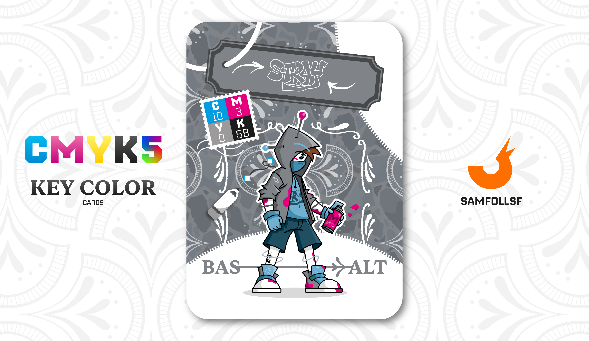

---
tags:
  - Street Art

...

# Stray

## Descrizione

Nessun muro è al sicuro, la sua tag "Stray" ha già invaso tutto il [Surface Web](../Remix/deep.md), ma non spargete troppo la voce: la magia dei [Graffiti](../Remix/graffiti.md) risiede anche nell'alone di mistero che avvolge l'autore. Le sue prede preferite sono gli edifici abbandonati sulle sponde dei grandi [Ristagni d'acqua](../Remix/frutiger.md). Il suo design ricorda quello di una bambola woodoo, con degli aghi giganti che gli perforano il capo.

## Colore

Il nome "Basalto" deriva dal latino basaltes, "roccia molto dura", anche se le origini del termine risalgono probabilmente alla lingua egizia. Intorno alla metà del Cinquecento si iniziò a usare questa parola per identificare la roccia nera vulcanica.

## Curiosità

- Una volta girò per il Web insieme a [SamFollSF](../Remix/samfollsf.md) e [Red Ghost](../Giallo/redghost.md) imbrattando le ville dei Manager più ricchi, un vero spasso rovinare le giornate a chi è ricco.
- Sul suo braccio è presente il logo del "Terzo Paradiso".
- Ha un tatoo fatto da Eras sulla gamba, mentre le scarpe che indossa sono brandizzate Robe.
- Stray è l'Agent di Michele Del Giudice.

# Versione Mazzo 1.0