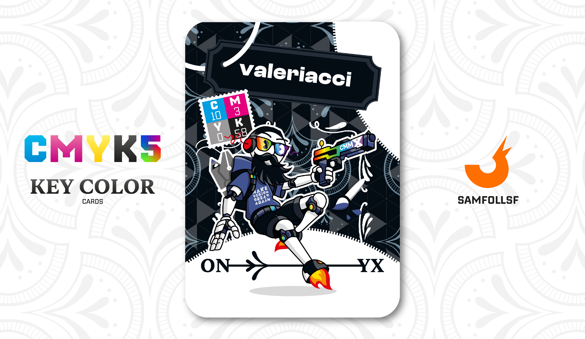

---
tags:
  - Fil di Ferro

...

# Valeriacci

## Descrizione

Il mitico Valeriacci, che ha introdotto a [SamFollSF](../Remix/samfollsf.md) tutte le nozioni per usare Adobe Illustrator nell'ormai lontano 2021. Il suo lavoro è il Grafico come la sua controparte reale, e anche qui nel Web ha diffuso fra la popolazione i suoi sticker (Make Design Great Again). Tuttavia non avrebbe mai pensato che [SamFollSF](../Remix/samfollsf.md) potesse diventare un contrabbandiere di materiali vettoriali grazie alle sue lezioni, ed infatti più volte è stato costretto a dissociarsi dalle pratiche del suo allievo.

## Colore

L'Onyx è una pietra della grande famiglia dei quarzi che racchiude misteri e leggende che nascono lì, dove il suo colore sembra nascondere qualcosa. Nera con striature bianche, assomiglia al calcedonio senza essere, però, cristallino.

## Curiosità

- L'arma che impugna nella carta si chiama CommandX, e il nome stesso ne svela il funzionamento. Grazie ai suoi proiettili, questa arma è in grado di tagliare i bersagli, facendoli non solo scomparire, ma anche copiando il loro intero codice sorgente. Tuttavia, questa copia viene immagazzinata nell'arma sotto forma di un file estremamente compresso. Solo abili Agent come [Kàruto](../Ciano/karuto.md) possono estrarre senza danneggiare il file l'intero codice.
- Il suo intero corpo è robotizzato, in riferimento alla prima esercitazione che io abbia mai fatto su Adobe Illustrator, magari un giorno ci farò una carta.
- Sulla sua felpa c'è la dicitura "Make Design Great Again".
- Porta sempre con sè gli strumenti di Adobe, in modo da disegnare ovunque lui si trovi.
- Valeriacci è l'Agent di Valerio Mattiacci.

# Versione Mazzo 1.0