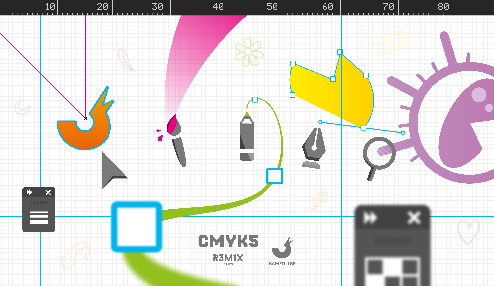
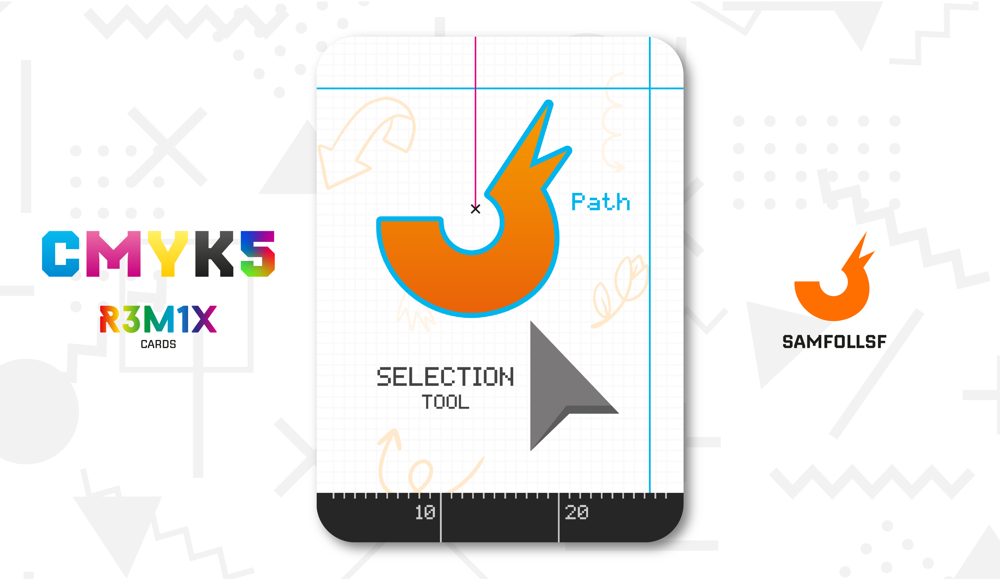
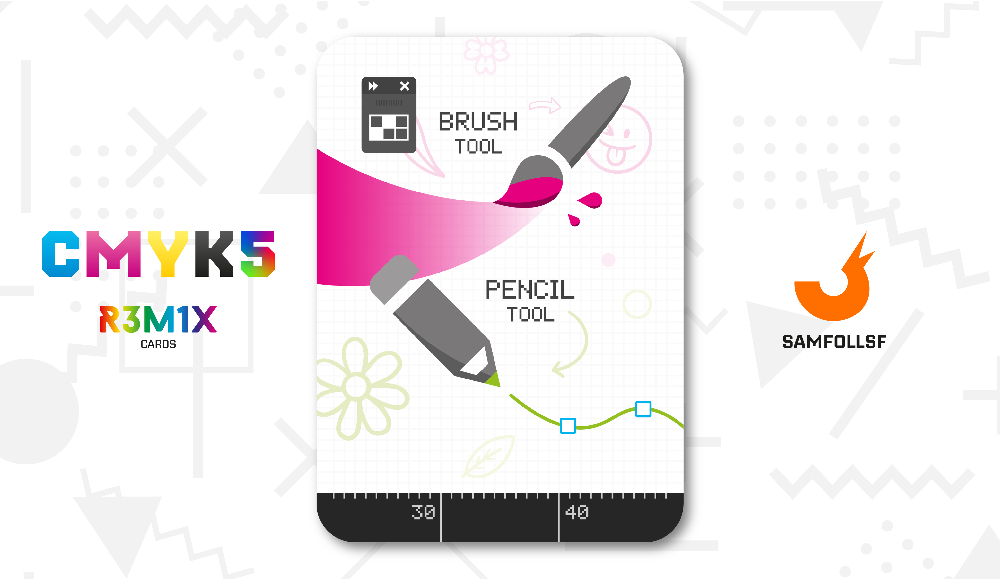
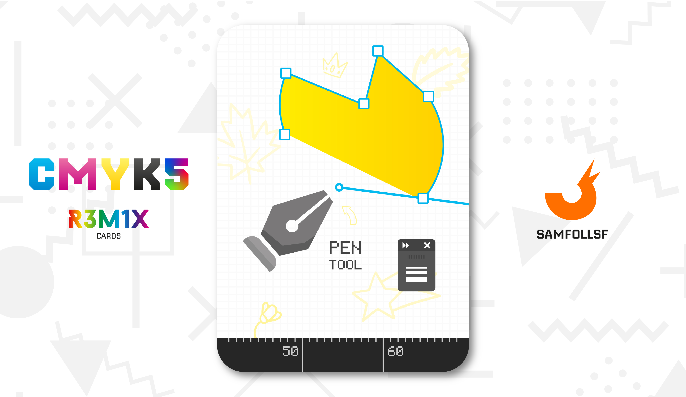
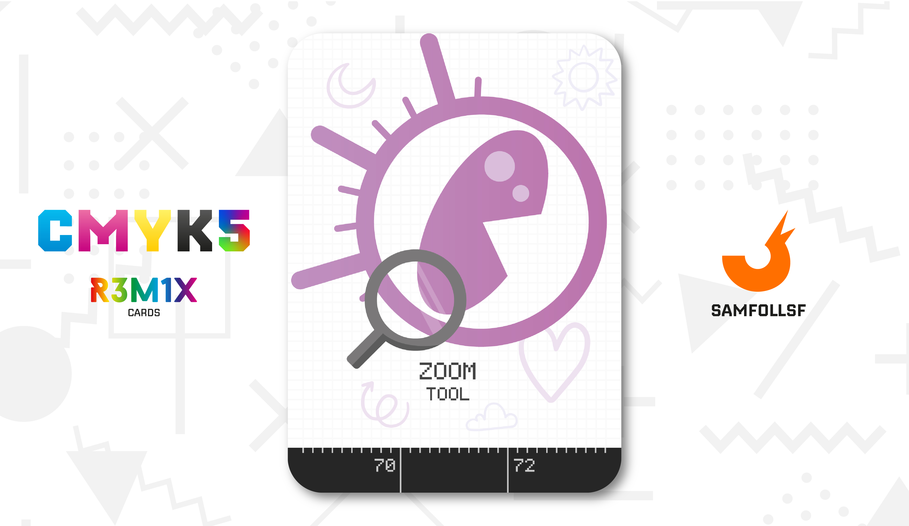

# Attrezzi del Mestiere

Gli "Attrezzi del mestiere" si riferiscono agli strumenti principali di Adobe Illustrator, che ho utilizzato per realizzare questo mazzo e che troviamo in ogni singola carta dei mazzi Ciano, Magenta, Giallo e Nero. Questi strumenti, tuttavia, sono disponibili anche in molti altri programmi della suite Adobe. Scopriamo insieme i primi cinque!

## Selezione

Lo strumento Selezione permette di selezionare un oggetto e decidere di spostarlo, modificarlo o eliminarlo. Nelle carte viene usato per analizzare dei dettagli sugli Agent e Manager.

## Pennello e Matita

Con lo strumento Pennello è possibile creare vettori a mano libera senza la rigidità dei punti di ancoraggio. Inoltre lo stile del tratto può essere completamente personalizzato, dal riempimento del tracciato alla morbidezza delle curve.

La matita funziona in modo simile, ma si distingue per la possibilità di creare esclusivamente tracciati senza riempimento.

## Penna

Con lo strumento Penna, creare forme anche molto stravaganti è semplicissimo: ogni clic del mouse aggiunge un punto di ancoraggio al tracciato, mentre ricliccarci sopra permette di eliminare il punto di ancoraggio interessato.

## Zoom

Lo Zoom è uno strumento indispensabile, utile sia per intervenire su piccoli dettagli della tavola da disegno che per osservare il lavoro nella sua interezza.

# Versione Mazzo 1.0