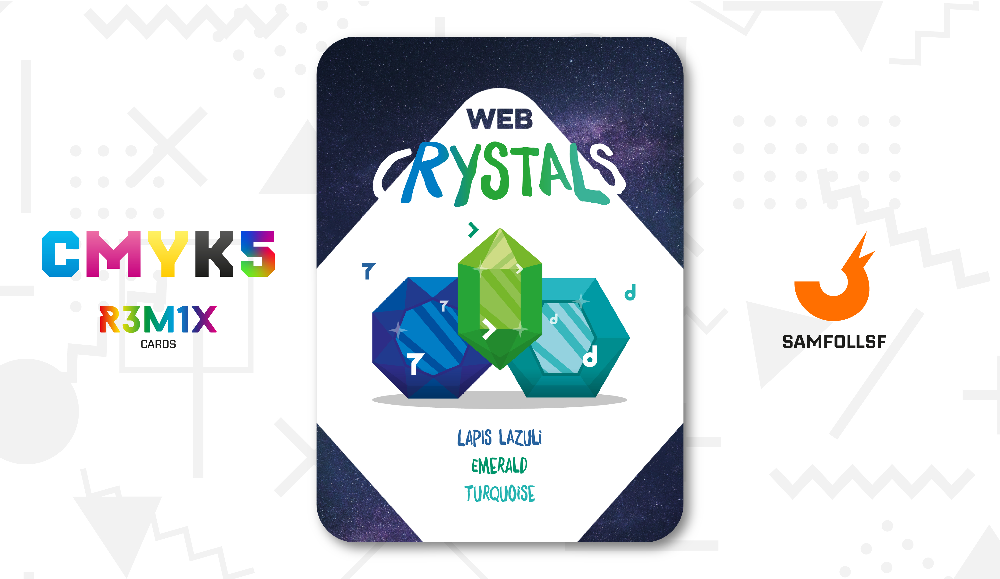
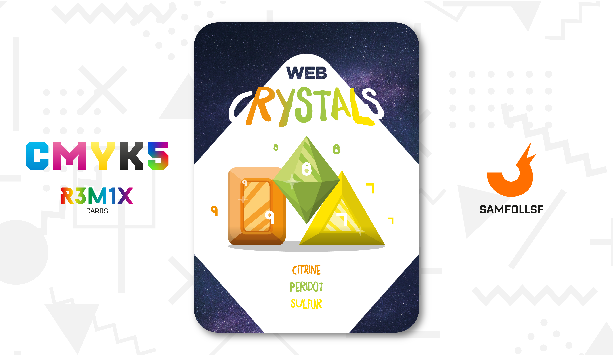

# Web Crystals

## Descrizione

I Cristalli del Web sono pietre preziose che offrono benefici, ciascuna con una caratteristica unica. La loro formazione non ha nulla a che vedere con processi fisici come solidificazioni o brinamenti: nel Web, i cristalli si generano attraverso un fenomeno comune a tutti, ovvero i bug. Esatto, i cristalli non sono altro che errori del sistema. Tuttavia, la loro diffusione divenne così ampia che, invece di eliminarli uno per uno, si decise di conservarli. Oggi possedere questi cristalli non è illegale, anche se il loro utilizzo è vietato in alcuni luoghi pubblici.

L'estrazione è un processo lungo e, con il passare degli anni, le risorse nelle cave del [Surface Web](../Remix/deep.md) si stanno esaurendo, fino al punto in cui non resterà più nemmeno un cristallo. Tuttavia, il [Dark Web](../Remix/deep.md) ne è ancora ricco, ma raggiungere quegli abissi rappresenta un'impresa estremamente difficile.

## Benefici

### Lapislazzulo, Smeraldo e Turchese

Il Lapislazzulo permette di migliorare le capacità uditive a lungo raggio.

Lo Smeraldo aumenta il coraggio del proprietario azzerando la paura verso ciò che prima temeva.

Il Turchese rende chi lo possiede più agile e veloce nei movimenti.

### Ametista, Rubino e Rubellite

L'Ametista permette di migliorare le capacità visive a lungo raggio.

Il Rubino aumenta la tolleranza al dolore del proprietario azzerandolo del tutto.

La Rubellite rende chi lo possiede di essere temuti e avere autorità.

### Citrino, Peridoto e Zolfo Cristallizato

Il Citrino permette di rimanere nella mente delle persone rendendole devote.

Il Peridoto aumenta le capacità di ricordare e riportare alla memoria.

Lo Zolfo Cristallizato rende chi lo possiede capace di illudere gli sguardi degli altri.

## Riferimenti

Chi possiede questi cristalli nei Mazzi CMYK?

Lapislazzulo: [The Deather](../Ciano/thedea.md)

Smeraldo: [NotFleex](../Ciano/notfleex.md)

Turchese: [KK](../Ciano/kekka.md)

Ametista: [IlPanettone](../Magenta/ilpanettone.md)

Rubino: [Chitty](../Magenta/chitty.md)

Rubellite: [Solisnoctix](../Magenta/solisnoctix.md)

Citrino: [Geadamn](../Giallo/geadamn.md)

Peridoto: [Prutusin](../Giallo/prezzemolo.md)

Zolfo Cristallizato: [Frashadow](../Giallo/frashadow.md)

# Versione Mazzo 1.0