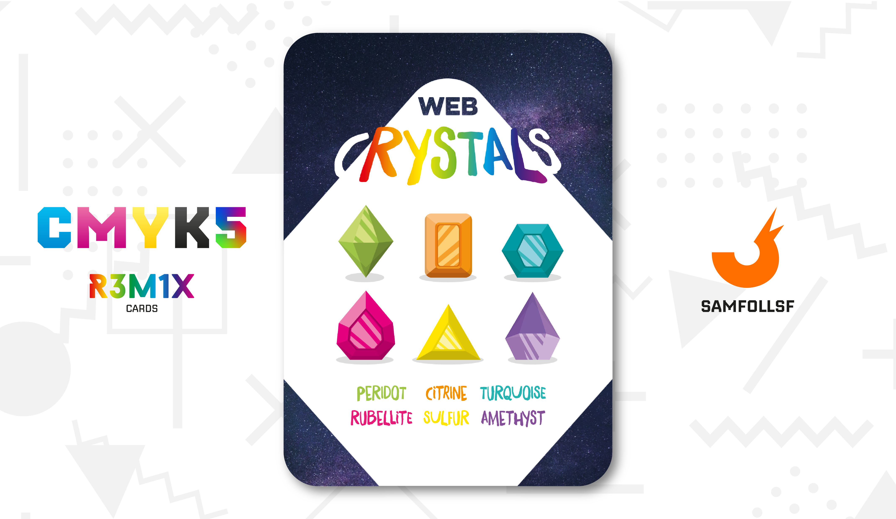
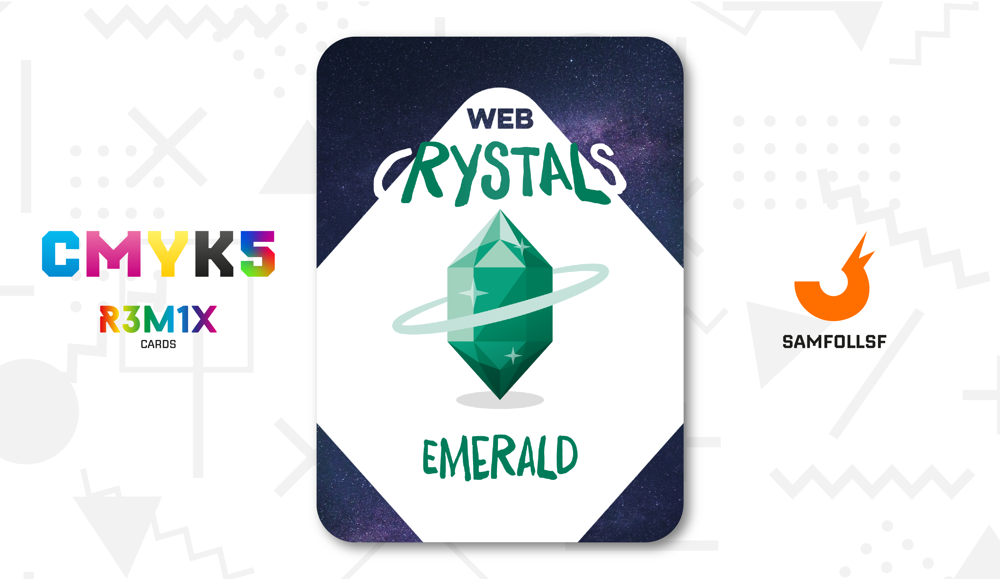
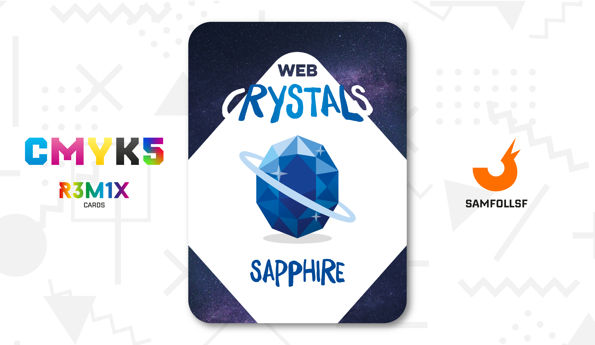
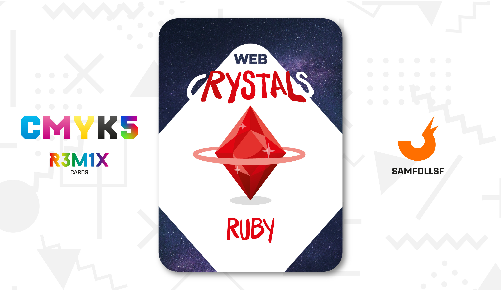

# Web Crystals

## Descrizione

I Cristalli del Web sono pietre preziose che offrono benefici (con intensità stabilita dai carati), ciascuna con una caratteristica unica. La loro formazione non ha nulla a che vedere con processi fisici come solidificazioni o brinamenti: nel Web, i cristalli si generano attraverso un fenomeno comune a tutti, ovvero i bug. Esatto, i cristalli non sono altro che errori del sistema. Tuttavia, la loro diffusione divenne così ampia che, invece di eliminarli uno per uno, si decise di conservarli. Oggi possedere questi cristalli non è illegale, anche se il loro utilizzo è vietato in alcuni luoghi militari o istituzionali.

L'estrazione è un processo lungo e, con il passare degli anni, le risorse nelle cave del [Surface Web](../Remix/deep.md) si stanno esaurendo, fino al punto in cui non resterà più nemmeno un cristallo. Tuttavia, il [Dark Web](../Remix/deep.md) ne è ancora ricchissimo, ma raggiungere quegli abissi rappresenta un'impresa ancora oggi incompiuta.

Tuttavia il potere dei Cristalli sublima nei Diamanti, le pietre preziose più forti dell'intero WebVerse. In ordine crescente di potere troviamo il Diamante Azzurro, poi Rosa, e infine Rosso. Lascio spazio prima ai cristalli più comuni per spostarci in un secondo momento ai Diamanti.

## Benefici - Cristalli Comuni

### Peridoto, Rubellite, Citrino, Zolfo Cristallizato, Turchese, Ametista

Il Peridoto migliora le capacità uditive.

La Rubellite rende chi lo possiede felice e sereno.

Il Citrino permette di aumentare il proprio carisma.

Lo Zolfo Cristallizato rende chi lo possiede capace di percepire il tempo più lentamente.

Il Turchese rende chi lo possiede più agile e veloce nei movimenti.

L'Ametista migliora le capacità visive a lungo raggio.

## Smeraldo

Lo Smeraldo è il primo cristallo nella gerarchia a fare sul serio, posizionandosi come controparte cristallina del [Rame](../Remix/metal.md). Come per i [Metalli Nobili](../Remix/metal.md) anche da questo livello di prestigio in poi essere in possesso di queste gemme è illegale, se non con particolari autorizzazioni da parte del governo.

Le proprietà dello Smeraldo permettono di immagazzinare energia elettrica, anche quella prodotta dai [Cavalieri di Rame](../Remix/metal.md), per scaraventarla sotto forma di dardi elettrici all'emittente. Questo aspetto rende questo cristallo sorprendentemente adatto per combattere i minerali che soffrono di sbalzi di tensione incontrollati molto forti, tra cui appunto il [Rame](../Remix/metal.md).

Il punto debole è la sua bassissima resistenza agli urti, basta una botta medio-intensa e il cristallo si frantuma in mille pezzi

## Zaffiro

Lo Zaffiro insieme all'[Argento](../Remix/metal.md) spostano le danze al cielo. Se quest'ultimo permette il volo, lo Zaffiro delega questa caratteristica al solo cristallo che si presenta come la freccia del cursore del mouse, muovendosi in aria come farebbe un drone.

Il Cursore di Zaffiro funziona come la freccia del mouse e si può usare in due modi:
- Click Sinistro: Afferra un nemico o un oggetto per spostarlo nello spazio. Finchè si tratta di materiali comuni o di [Rame](../Remix/metal.md) il suo funzionamento è impeccabile. Ma se ci spostiamo ai piani più alti come l'[Oro](../Remix/metal.md) la storia cambia radiclamente: spostare mineriali più nobili è praticamente inutile in combattimento data la loro densità di dati.
- Click Destro: Come per il click sinistro più il minerale è denso di dati e più lo Zaffiro arrancherà nell'elaborazione delle funzioni. Come per la controparte reale questo click permette di aprire un menù a tendina di fianco all'oggetto / nemico selezionato. Il menù prevede funzioni come "Ispeziona", "Copia" (se si dispone di una [Forbice Copypasta](../Remix/tool.md)), "Muta" per silenziare i suoni e ultimo ma assolutamente non per importanza il tasto "Pausa". Quest'ultimo bloccherà completamente il nemico, rendendolo un perfetto ornamento in soggiorno. Il funzionamento è impeccabile se si combatte nemici dello stesso livello, ma se si vuole mettere in pausa un Rubino bisogna aspettare (con tanto di rotella di caricamento) che lo Zaffiro analizzi tutta l'unità prima di intervenire. È teoricamente possibile congelare un Rubino? Sì. Quanto dura l'analisi? 5 minuti. Il nemico ha tutto il tempo prendersi un caffè al bar per poi disintegrarti. Per un Diamante Azzurro? 18 ore.

## Rubino

Il Rubino è il Web Crystal che precede l'élite della gerarchia. In questi termini non delude affatto, presentandosi come controparte cristallina dell'[Oro](../Remix/metal.md).

La sua peculiarità risiede nell'utilizzo della tecnologia Thunderbolt. Il Rubino permette di "connettersi" al nemico letteralmente con un cavo sparato a velocità elevatissime verso il bersaglio, e una volta connesso non c'è speranza per l'eventuale [Bruto Dorato](../Remix/metal.md). Il cavo permette al Rubino di controllare il corpo dell'obiettivo, facendo perdere qualsiasi tipo di controllo, ricordando quello che si prova in una paralisi. Non è tutto, la tecnologia Thunderbolt ha una caratteristica unica: permette di creare dei ponti fra hardware diversi sfruttando l'immensità della largezza di banda. Tradotto: nel caso in cui un Agent in possesso di Rubino si trovi di fronte a venti [Cavalieri di Rame](../Remix/metal.md) può usare il suo potere per avviare una catena di connessioni, che parte dal primo cavaliere e si espande al secondo, poi al terzo e così via sfruttando un solo filamento di Rubino.

Il cavo può estendrsi per la sorprendente distanza di massimo un milione di pixel (1Km), ma è qui che il cristallo mostra il fianco: più il cavo si allunga e non solo perde largezza di banda disponibile man mano che si controllano più nemici insieme, ma si assottiglia fisicamente, e più è sottile e più è facile da tagliare. Se si rimane nei dieci metri allora solo l'[Oro](../Remix/metal.md) può tagliarlo, ma quando si estende per tantissimi pixel allora anche il [Rame](../Remix/metal.md) può tagliarlo, mandando in crash il Rubino costringendo il possessore ad aspettare un caricamento di riavvio, che può durare anche diversi minuti.

## Diamanti

Entriamo nel vivo dei Web Crystals introducendo i Diamanti. Queste gemme si formano come le controparti più comuni: non sono altro che dei bug di sistema. Tuttavia qui parliamo di falle nella scrittura del web molto grandi, per questo sono sia molto rari ma anche estremamente potenti. Possiamo classificarli in ordine crescente di prestigio: Azzurro, Rosa e Oscuro, con dei poteri unici per ogni colorazione.

### Diamante Azzurro

Quello più comune, anche se comune si fa per dire. Il suo potere speciale è quello di entrare in simbiosi con l'ambiente circostante, modificandolo e cristallizzandolo a proprio piacimento. Ciò avviene in una prima fase di analisi dell'ambiente, che rende tutto agli occhi del possessore coperto di un reticolo azzurro acceso, disattivando le texture originali e permettendo di ottenere l'unica informazione utile: i poligoni della zona, dal momento che qualunque intervento di modifica del mondo farebbe diventare quella porzione composta di un cristallo indistruttibile.

[Solisnoctix](../Magenta/solisnoctix.md) è in possesso di un Diamante Azzurro, quello che può fare è ad esempio selezionare un'auto, rendendola al 100% di cristallo e scaraventarla contro un bersaglio, tutto in meno di 5 secondi. Per certi versi può ricordare il tocco di Mida, solo che qui si rendono gli oggetti cristalli durissimi,i mpossibili da scalfire per qualsiasi cristallo o [Metallo Nobile](../Remix/metal.md) che non sia [Platino](../Remix/metal.md).

Il limite di questo Diamante è nel raggio d'azione. Più ci si allontana e meno l'effetto sarà eseguito in maniera corretta, e il cristallo prodotto sarà man mano più facile da rompere, anche per un [Cavalieri di Rame](../Remix/metal.md).

### Diamante Rosa

Il gradino intermedio. Entriamo nella zona dove il potere diventa biomeccanicamente impossibile da sostenere per un Agent, al pari di quello che accade possedendo [Platino](../Remix/metal.md) più puro dell'80%, con stime che suggeriscono paragonabili livelli di potenza.

Il Diamante Rosa ha come potere peculiare quello di poter modificare a piacimento e con conoscenza completa il proprio codice sorgente. Per intenderci, è lo stesso che viene studiato nelle [Palestre di ricerca](../Giallo/mc6.md), solo che con una consapevolezza al 100% della propria natura e la possibilità di modificarla a piacimento, ci si può rendere quasi invincibili, con valori e quantità di danni inflitti spropositati. Si diventa immuni alle leggi comuni della fisica del WebVerse.

### Diamante Oscuro

Con il Diamante Oscuro si entra nella sfera speculativa, dal momento che non è certa nemmeno la sua stessa esistenza. Ciò che è attualmente conosciuto è che il potere dei Diamanti e [Metalli Nobili](../Remix/metal.md) cresce in modo esponenziale, e quindi se per il [Platino](../Remix/metal.md) con il 60% di purezza esiste una controparte cristallina, ovvero il Diamante Azzurro, e così via per il [Platino](../Remix/metal.md) puro all'80% con il Diamante Rosa, deve esserci qualcosa che possa controbilanciare il [Platino](../Remix/metal.md) dal 90% al 100% di purezza.

Leggende narrano di questo Diamante Oscuro in grado di rendere chi ne fosse in possesso una vera e propria divinità, capace di sovvertire tutte le regole e il destino del WebVerse, potendo letteralmente riscrivere la storia dell'intero universo. Ad esclusione, l'unica zona del WebVerse dove potrebbe esserci questo minerale è il [Dark Web](../Remix/deep.md), dove giacciono grandi quantità di Web Crystals, ma nessuno ha mai potuto provare l'esistenza di un Diamante Oscuro.

A questo livello si sublima la differenza di logiche tra [Metalli Nobili](../Remix/metal.md) e Web Crystal. I primi cercando di vincere usando la forza bruta, la creazione e la resistenza. I cristalli invece seguono una logica d'astuzia sfruttando quello che già esiste, modificandolo e controllandolo, per trarne un vantaggio: un'approccio più elegante e strategico.

Tutta questa storia è di forte interesse per gli Overlords del Web, e la corsa al Diamante Oscuro può essere davvero pericolosa, portando alla follia più totale, cercando qualcosa che non si è nemmeno sicuri esista. Tra i principali ricercatori di questa infinita gloria troviamo [Sa742Sa](../Remix/sa742sa.md) e [Solisnoctix](../Magenta/solisnoctix.md).

## Riferimenti

Chi possiede questi cristalli nei Mazzi CMYK?

Zaffiro: [The Deather](../Ciano/thedea.md)

Smeraldo: [NotFleex](../Ciano/notfleex.md)

Turchese: [KK](../Ciano/kka.md) e [Red Ghost](../Giallo/redghost.md)

Ametista: [IlPanettone](../Magenta/ilpanettone.md)

Rubino: [Chitty](../Magenta/chitty.md)

Rubellite e Diamante Azzurro: [Solisnoctix](../Magenta/solisnoctix.md)

Citrino: [Geadamn](../Giallo/geadamn.md)

Peridoto: [Prutusin](../Giallo/prutusin.md)

Zolfo Cristallizato: [Frashadow](../Giallo/frashadow.md)