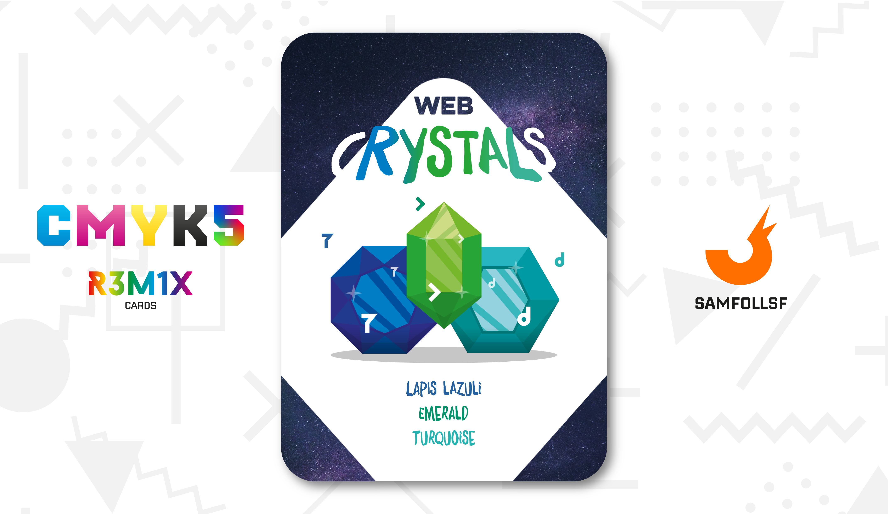
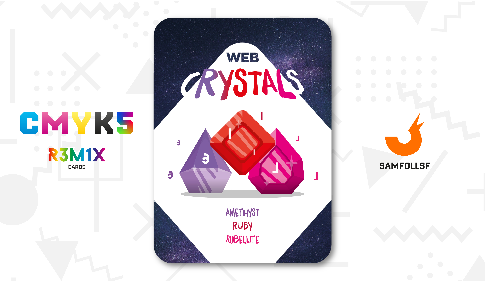
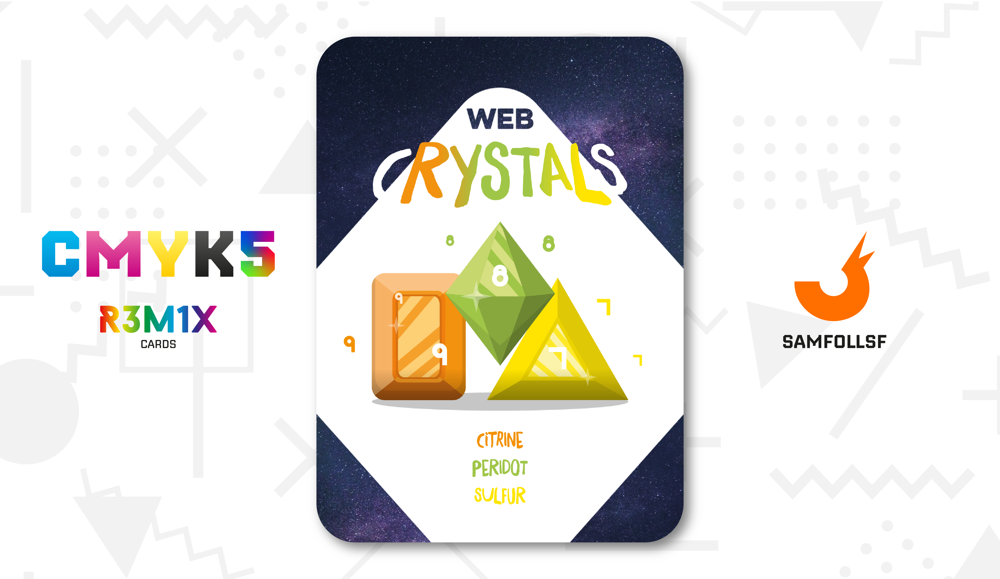

# Web Crystals

## Descrizione

I Cristalli del Web sono pietre preziose che offrono benefici (con intensità stabilita dai carati), ciascuna con una caratteristica unica. La loro formazione non ha nulla a che vedere con processi fisici come solidificazioni o brinamenti: nel Web, i cristalli si generano attraverso un fenomeno comune a tutti, ovvero i bug. Esatto, i cristalli non sono altro che errori del sistema. Tuttavia, la loro diffusione divenne così ampia che, invece di eliminarli uno per uno, si decise di conservarli. Oggi possedere questi cristalli non è illegale, anche se il loro utilizzo è vietato in alcuni luoghi militari o istituzionali.

L'estrazione è un processo lungo e, con il passare degli anni, le risorse nelle cave del [Surface Web](../Remix/deep.md) si stanno esaurendo, fino al punto in cui non resterà più nemmeno un cristallo. Tuttavia, il [Dark Web](../Remix/deep.md) ne è ancora ricchissimo, ma raggiungere quegli abissi rappresenta un'impresa ancora oggi incompiuta.

Tuttavia il potere dei Cristalli sublima nei Diamanti, le pietre preziose più forti dell'intero WebVerse. In ordine crescente di potere troviamo il Diamante Azzurro, poi Rosa, e infine Rosso. Lascio spazio prima ai cristalli più comuni per spostarci in un secondo momento ai Diamanti.

## Benefici - Cristalli Comuni

### Lapislazzulo, Smeraldo e Turchese

Il Lapislazzulo permette di migliorare le capacità uditive.

Lo Smeraldo aumenta il coraggio del proprietario azzerando la paura.

Il Turchese rende chi lo possiede più agile e veloce nei movimenti.

### Ametista, Rubino e Rubellite

L'Ametista permette di migliorare le capacità visive a lungo raggio.

Il Rubino aumenta la tolleranza al dolore sia fisico che psicologico del proprietario azzerandolo del tutto.

La Rubellite rende chi lo possiede felice e sereno.

### Citrino, Peridoto e Zolfo Cristallizato

Il Citrino permette di aumentare il proprio carisma.

Il Peridoto aumenta le capacità di riportare alla memoria.

Lo Zolfo Cristallizato rende chi lo possiede capace di percepire il tempo più lentamente.

## Diamanti

Entriamo nel vivo dei Web Crystals introducendo i Diamanti. Queste gemme si formano come le controparti più comuni: non sono altro che dei bug di sistema. Tuttavia qui parliamo di falle nella scrittura del web molto grandi, per questo sono sia molto rari ma anche estremamente potenti. Possiamo classificarli in ordine crescente di prestigio: Azzurro, Rosa e Rosso.

### Diamante Azzurro

Quello più comune, anche se comune si fa per dire. A differenza dei cristalli minori, il diamante conferisce una vera e propria svolta per i combattimenti. Oltre ad avere tutti i poteri dei 9 cristalli già citati, se ne aggiunge un decimo, unico per ogni diamante.

Per quanto riguarda il diamante azzurro, il suo potere speciale è quello di entrare in simbiosi con l'ambiente circostante, modificandolo e cristallizzandolo a proprio piacimento.

[Solisnoctix](../Magenta/solisnoctix.md) è in possesso di un Diamante Azzurro, quello che può fare è ad esempio entrare in un auto, fondendosi con essa, cambiare la sua composizione chimica in 100% cristallo, e poterla scaraventare contro un bersaglio, tutto in meno di 5 secondi. Per certi versi può ricordare il tocco di Mida, solo che qui si rendono gli oggetti cristalli durissimi, non Diamanti extra, ma comunque impossibili per qualsiasi cristallo o metallo che non sia [Platino](../Remix/metal.md) da scalfire.

### Diamante Rosa

Il gradino intermedio. Entriamo nella zona dove il potere diventa biomeccanicamente impossibile da sostenere per un Agent, al pari di quello che accade possedendo [Platino](../Remix/metal.md) più puro dell'80%, con stime che suggeriscono paragonabili livelli di potenza. Ma c'è di più, è sempre più accertato che Web Crystals così forti come i Diamanti sono un ottimo rimedio contro i parassiti metallici.

Il Diamante Rosa ha come potere peculiare quello di poter modificare a piacimento e con conoscenza completa il proprio codice sorgente. Per intenderci, è lo stesso che viene studiato nelle [Palestre di ricerca](../Giallo/mc6.md), solo che con una consapevolezza al 100% della propria natura e la possibilità di modificarla a piacimento, ci si può rendere quasi invincibili, con valori e quantità di danni inflitti spropositati. Si diventa immuni alle leggi comuni della fisica del WebVerse.

### Diamante Rosso

Con il Diamante Rosso si entra nella sfera speculativa, dal momento che non è certa nemmeno la sua stessa esistenza. Infatti ciò che è attualmente conosciuto è che il potere dei Diamanti e [Metalli Nobili](../Remix/metal.md) cresce in modo esponenziale, e quindi se per il [Platino](../Remix/metal.md) con il 70% di purezza esiste una controparte cristallina, ovvero il Diamante Azzurro, e così via per il [Platino](../Remix/metal.md) all'80% con il Diamante Rosa, deve esserci qualcosa che possa controbilanciare il [Platino](../Remix/metal.md) dal 90% al 100% di purezza.

Leggende narrano di questo Diamante Rosso in grado di rendere chi ne fosse in possesso una vera e propria divinità, capace di sovvertire tutte le regole e il destino del WebVerse, potendo letteralmente riscrivere la storia dell'intero universo. Ad esclusione, l'unica zona del WebVerse dove potrebbe esserci questo minerale è il [Dark Web](../Remix/deep.md), dove giacciono grandi quantità di Web Crystals, ma nessuno ha mai potuto provare l'esistenza di un Diamante Rosso.

Tutta questa storia è di forte interesse per gli Overlords del Web, e la corsa al Diamante Rosso può essere davvero pericolosa, portando alla follia più totale, cercando qualcosa che non si è nemmeno sicuri esista. Tra i principali ricercatori di questa infinita gloria troviamo [Sa742Sa](../Remix/sa742sa.md) e [Solisnoctix](../Magenta/solisnoctix.md).

## Riferimenti

Chi possiede questi cristalli nei Mazzi CMYK?

Lapislazzulo: [The Deather](../Ciano/thedea.md)

Smeraldo: [NotFleex](../Ciano/notfleex.md)

Turchese: [KK](../Ciano/kka.md)

Ametista: [IlPanettone](../Magenta/ilpanettone.md)

Rubino: [Chitty](../Magenta/chitty.md)

Rubellite e Diamante Azzurro: [Solisnoctix](../Magenta/solisnoctix.md)

Citrino: [Geadamn](../Giallo/geadamn.md)

Peridoto: [Prutusin](../Giallo/prutusin.md)

Zolfo Cristallizato: [Frashadow](../Giallo/frashadow.md)