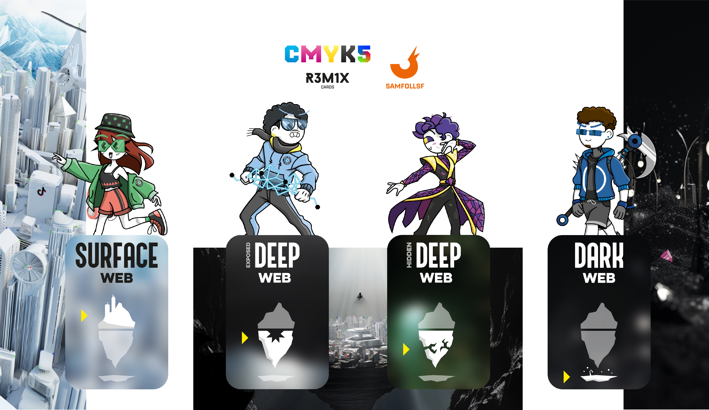
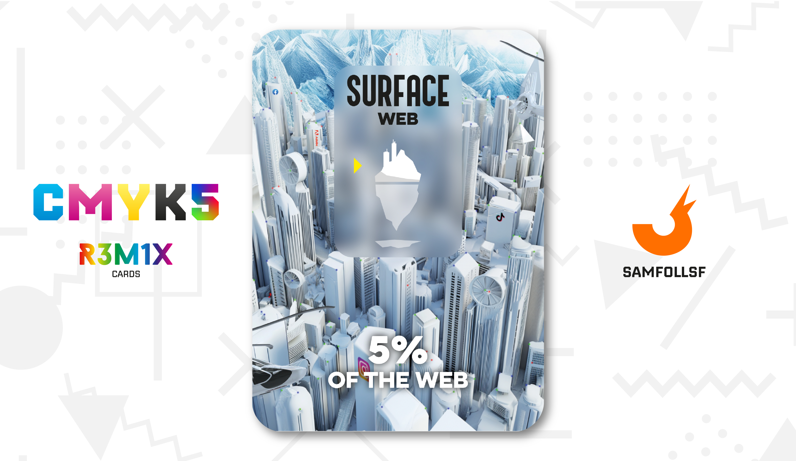
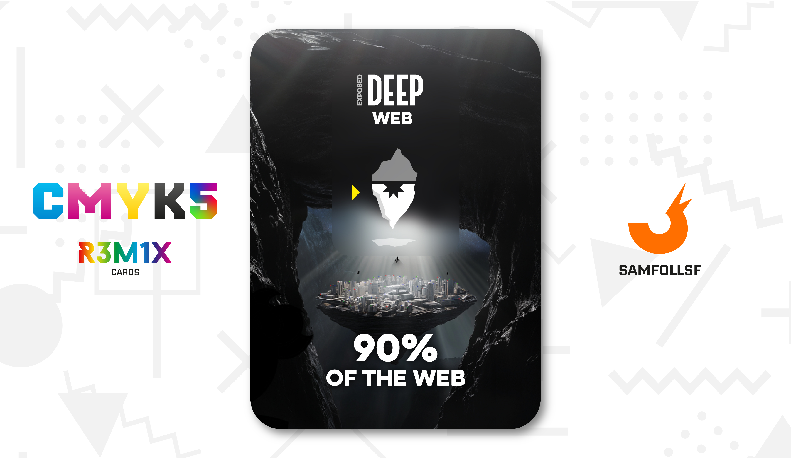
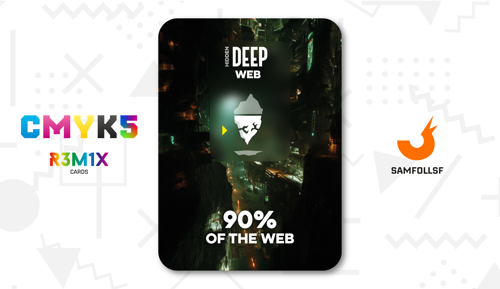
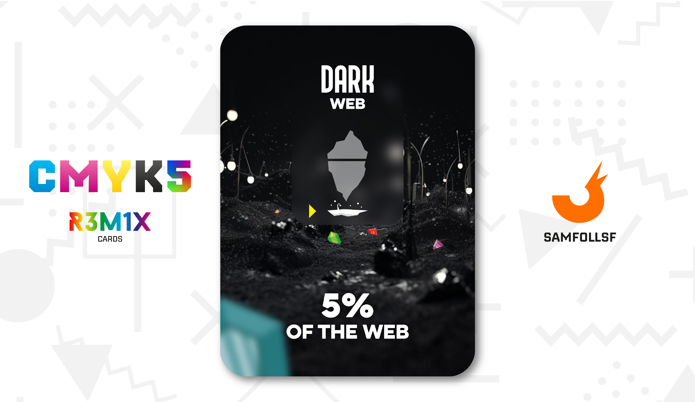

# Iceberg

## L'iceberg

Ogni classe sociale degli abitanti del Web ha una propria regione di appartenenza: Nel Surface Web troviamo Agent e Manager, nel Deep Web gli Overthrown e nel Dark Web nessuna forma di vita, inaccessibile per chiunque.

## Surface Web

Il Surface Web rappresenta la punta dell'iceberg: è il dominio esclusivo dell'élite del Web, accessibile attraverso piattaforme come Meta, Amazon e altre risorse che i browser, come Chrome, riescono a raggiungere. Si presenta come una vasta megatropoli suddivisa in 999 blocchi, fitta di grattacieli bianchi che non solo ospitano le pagine del Web, ma anche servizi per gli Agent, come ristoranti e aree di svago. Ci sono anche enormi paludi, costituite da ampi [Ristagni d'acqua](../Remix/frutiger.md) verde scuro, residue dell'era Frutiger Aero terminata nel 2010. 

Nonostante la sua apparente modernità, questa città è afflitta da criminalità organizzata, corruzione, omicidi e misteri irrisolti, proprio come accadrebbe in una grande città nel mondo reale. Per mantenere l'ordine pubblico e contrastare le minacce, sono presenti enti governativi, che sebbene introdotti nel Web, sono gestiti solo in parte dai nostri reali. Troviamo: la "Digital Court" che emette condanne per chi viola le leggi del Web; la "Web Intelligence", un'organizzazione di servizi segreti che tiene sotto controllo i clan e i superlatitanti del Surface Web, operando in numerosi padiglioni della loro sede centrale. Infine, la "Golden Force", l'esercito del Web che opera principalmente nel Deep Web, che garantisce la sicurezza nel Surface e nel Deep Web Esposto, affrontando in particolare i clandestini provenienti dalle regioni remote del Deep Web Nascosto.

## Deep Web - Esposto

Il Deep Web si divide in due aree distinte. La zona più esposta, una grande isola fluttuante all'interno di un'enorme caverna, è simile al Surface Web per leggi e strutture, quasi un'oasi nell'oscurità dell'iceberg digitale. Tuttavia, ciò che distingue questa città dalla superficie è il controllo maniacale esercitato dal governo. Ogni Agent o Manager che vi accede è scortato e identificato dai [Bruti Dorati](../Remix/metal.md), una forza speciale che monitora costantemente ogni individuo. Questo sistema consente di consultare rapidamente le informazioni anagrafiche di chiunque, facilitando l'identificazione immediata di eventuali fuggitivi.

Ma cosa rende il Deep Web così importante da spingere Agent e Manager a scendere in questa remota regione del Web? Qui sono custoditi tutti i dati sensibili, come password e informazioni riservate, archiviati in strutture altamente protette sull'isola e sorvegliati da soldati locali. Per accedere alla propria area riservata, ogni Agent o Manager deve esibire un documento d'identità e seguire procedure rigorose. Curiosità: quando sentiamo parlare di VPN, non sono altro che archivi esclusivi destinati agli utenti abbonati a determinati servizi.

## Deep Web - Nascosto

Come accennato in precedenza, il Deep Web si divide in due parti. Ora è il momento di esplorare quella più nascosta. Come suggerisce il nome, questa zona è difficilmente accessibile e, di fatto, entrarvi è considerato illegale. Tuttavia, per i più curiosi, ecco come vi si accede: attraverso fori clandestini scavati nel suolo del Surface Web. Di norma, l'accesso legale al Deep Web avviene tramite una gigantesca voragine che collega il Surface Web al Deep Web regolamentato. Ma esistono alternative illegali: scavando con le giuste attrezzature, è possibile aprire passaggi segreti che conducono a aree proibite, teoricamente inaccessibili.

Questi fori portano a un intricato sistema di caverne, nascoste sotto la voragine principale, che si diramano per tutto l’iceberg digitale senza mai confluire nell’area controllata. Qui, la situazione cambia radicalmente. Questo Deep Web nascosto è un vero e proprio far west, un regno di caos assoluto popolato da esiliati e criminali di ogni genere, tra cui contrabbandieri, sicari e fuggitivi.

Tuttavia, l'accesso a queste zone comporta rischi enormi. Se il governo sorprende qualcuno mentre entra o esce da una di queste entrate clandestine, le conseguenze possono essere gravissime, fino alla pena di morte. Le leggi locali prevedono infatti di sparare a vista contro chiunque violi questi confini proibiti.

## Dark Web

Infine troviamo il Dark Web. Non mi dilungherò troppo per questo livello. È principalmente un abisso privo di forme di vita, e si presenta come una landa desolata. Qui è dove si accumulano i file cache di Agent e Manager defunti, che illuminano l'era circostante. Questa zona è inaccessibile per chiunque, anche per il governo stesso. Si trova alla base di tutto il Web, sotto il Deep Web, il fondale dell'oceano.

Come è possibile vedere nella carta è presente una grande quantità di [Web Crystals](../Remix/crystal.md)

# Versione Mazzo 1.0