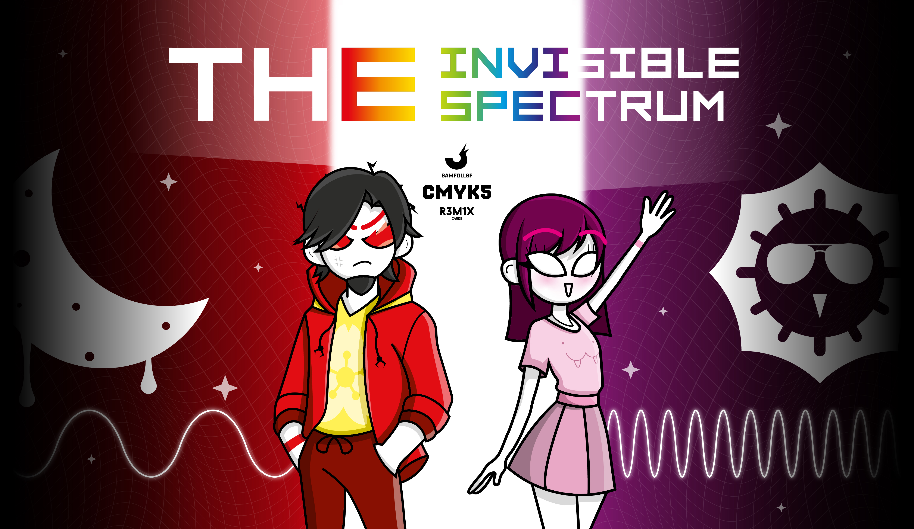
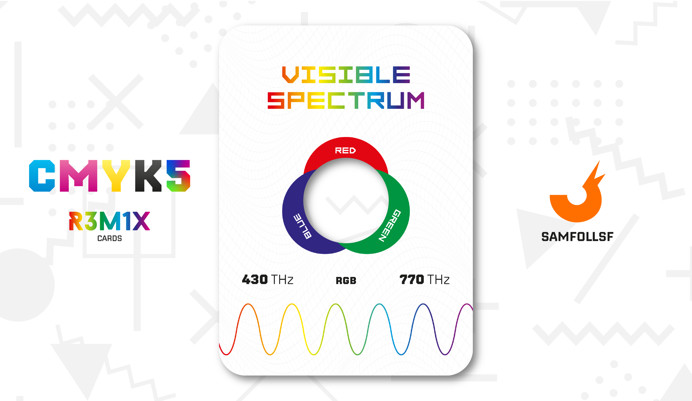

# Extraspettrali

Gli esseri umani possono vedere solo un certo raggio di frequenze elettromagnetiche, rendendo impossibile percepire l'Infrarossi e l'Ultravioletto ad occhio nudo. Cosa si cela in questa parte nascosta della luce?

## Spettro Visibile

Questa carta rappresenta lo spettro elettromagnetico visibile a occhio nudo, con frequenze che spaziano da 430 Thz a 770 Thz. La sua particolarità sta in una piccola finestrella al centro, attraverso la quale possiamo osservare come la sintesi dei colori primari della luce permetta di vedere l’intero spettro visibile. Questo è possibile grazie ai tre tipi di ricettori presenti nei nostri occhi: blu, rosso e verde. Questi inviano dati al cervello, che li elabora per ricostruire tutti i colori percepibili.

Un dettaglio interessante riguarda il Magenta. Nello spettro elettromagnetico non esiste una frequenza corrispondente a questo colore. Come possiamo allora vederlo? In realtà, il Magenta non esiste fisicamente nello spettro: è creato dal nostro cervello per collegare le gradazioni di rosso e viola, armonizzando il passaggio tra i due.

## Infrarossi

E se nello spettro elettromagnetico Infrarosso si celasse  una nuova sintesi di colori? Formata da 3 colori per noi sconosciuti come il Thermon, il Nyris e il Flaxer?. Formando così la stintesi TNF, visibile dalle frequenze che partono da 300 GHz fino a 430 THz.

Tuttavia quello che per la Sintesi Additiva culminerebbe nel Bianco con l'unione dei tre colori primari qui è un colore completamente sconosciuto anche nel WebVerse.

La tecnologia infrarossa trova numerose applicazioni nella vita quotidiana, dalla trasmissione di dati tramite telecomandi e dispositivi a infrarossi, al controllo della temperatura con termometri e termocamere. È utilizzata anche nei sistemi di sicurezza, come i sensori di movimento, e in ambito medico per rilevare calore corporeo o infiammazioni. Inoltre, viene impiegata nelle reti wireless a corto raggio e nelle apparecchiature per migliorare la visibilità notturna.

### Kyle

Kyle, un personaggio già apparso nella carta [Oro](../Remix/metal.md). Per il momento non voglio dire nulla su di lui per creare volutamente mistero dietro questa carta. Una cosa che posso dirvi è che Kyle è un Nativo del Web, e quindi non esiste per via di un Utente Umano.

Come per il Mazzo CMYK Anche qui però abbiamo un colore associato a lui, l'"Eclion" formato da: 34 di Thermon; 100 di Nyris e 90 di Flaxer. Ovviamente sia la carta che il colore sono completamente neri, in quanto l'occhio umano non riesce a vedere questi colori.  

## Ultravioletti

E se nello spettro elettromagnetico Ultravioletto si celasse  una nuova sintesi di colori? Formata da 3 colori per noi sconosciuti come l'Aurora, il Noctis e lo Spectra? Formando così la stintesi ANS, visibile dalle frequenze che partono da 770 THz fino a 30 PHz.

Tuttavia quello che per la Sintesi Additiva culminerebbe nel Bianco con l'unione dei tre colori primari qui è un colore completamente sconosciuto anche nel WebVerse.

La tecnologia ultravioletta ha diverse applicazioni nella vita quotidiana, dalla sterilizzazione di acqua, aria e superfici tramite lampade UV, al controllo di autenticità di banconote e documenti. È utilizzata anche nella medicina per trattamenti dermatologici e nella diagnostica con apparecchiature specializzate. Inoltre, l'UV trova impiego nei sistemi di illuminazione per effetti speciali e nella cura di materiali come vernici e adesivi che si asciugano sotto luce ultravioletta.

### Katia

Katia, un personaggio già apparso nella carta [Argento](../Remix/metal.md). Per il momento non voglio dire nulla su di lei per creare volutamente mistero dietro questa carta. Una cosa che posso dirvi è che Katia è un Nativa del Web, e quindi non esiste per via di un Utente Umano.

Come per il Mazzo CMYK Anche qui però abbiamo un colore associato a lei, il "Lucid Shade" formato da: 83 di Aurora; 35 di Noctis e 90 di Spectra. Ovviamente sia la carta che il colore sono completamente neri, in quanto l'occhio umano non riesce a vedere questi colori. 

# Versione Mazzo 1.0