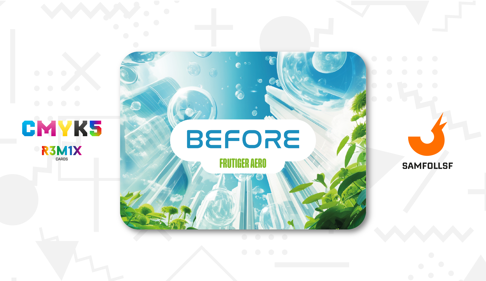
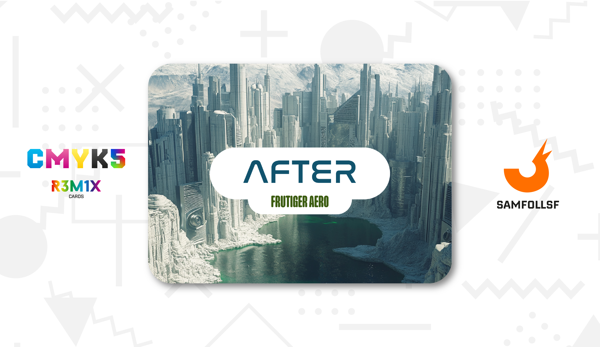

# Frutiger Aero

## 2000 - 2010

Il Frutiger Aero, noto anche come Web 2.0 Gloss, è uno stile di design che ha dominato vari settori, tra cui pubblicità, media, immagini stock e tecnologia, tra il 2004 e il 2013. Nato dopo l’estetica Y2K, si distingue per il frequente uso di skeuomorfismo, texture lucide, colori vivaci (soprattutto tonalità di verde e blu) ed elementi naturali come cieli nuvolosi, pesci tropicali, acqua e bolle. Caratteristici dello stile sono anche effetti come lens flare, bokeh, motivi tecnologici astratti, gradienti ispirati all’aurora e l’uso ricorrente del carattere tipografico Frutiger.

Rappresentava una visione di un mondo rinnovabile e armonioso, in cui tecnologia e natura coesistevano in equilibrio perfetto, alimentando un immaginario di progresso sostenibile e ottimismo ambientale. Tuttavia, nel tempo, questa visione ottimista si è trasformata in uno stile di design molto diverso, caratterizzato da un minimalismo corporativo più freddo e pragmatico, abbandonando la ricchezza visiva e l'impegno simbolico verso la sostenibilità, sostituendoli con forme semplici, colori neutri e linee essenziali, segnando un distacco dall'immaginario ambientalista e idealistico. Questo riflette un cambiamento nei valori culturali, in cui il rispetto per l'ambiente e l'ottimismo per il futuro hanno lasciato spazio a un approccio più sterile che, sebbene razionale e orientato al mercato, manca della visione utopistica che aveva reso il Frutiger Aero così attraente e simbolico del suo tempo.

Una volta il Web era pieno di questa vegetazione, lunghi prati e laghi armoniosi, il freddo della metropoli quasi non si sentiva.

## 2010 - Oggi

Oggi del Frutiger Aero rimangono tracce nostalgiche e influenze indirette nel design contemporaneo. Sebbene superato dal minimalismo, il suo spirito ottimista e accogliente sopravvive, evocando una visione luminosa e naturale della tecnologia. Esso verrà ricordato come un'epoca di equilibrio tra innovazione e bellezza, ispirando ancora oggi progetti che giocano sulla nostalgia o sul retrofuturismo.

Con il passare degli anni, tutta l'acqua si è raccolta in grandi ristagni, ma l'assenza di vegetazione e il colore scuro delle acque riflettono chiaramente come l'ottimismo nel Web sia ormai svanito.

# Versione Mazzo 1.0