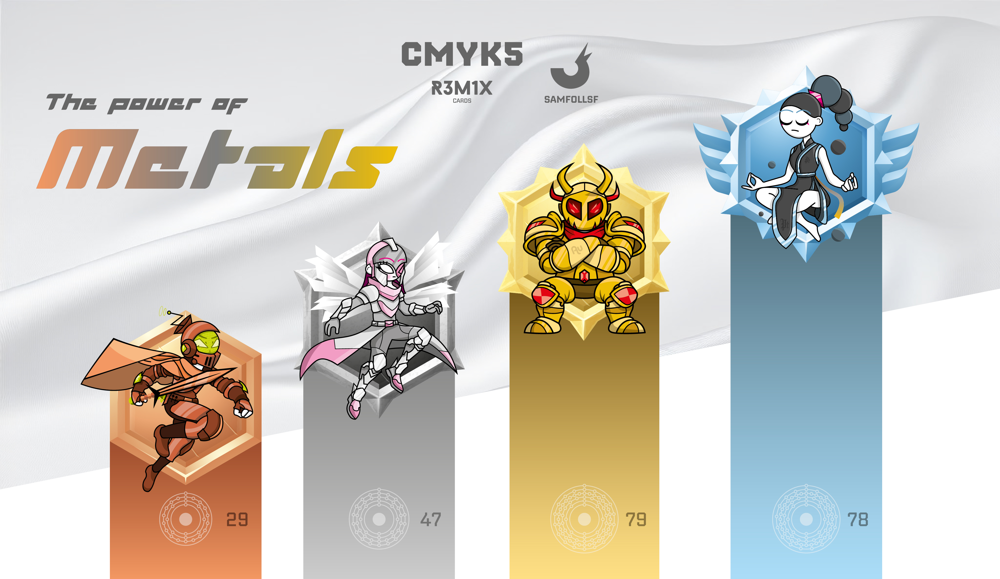
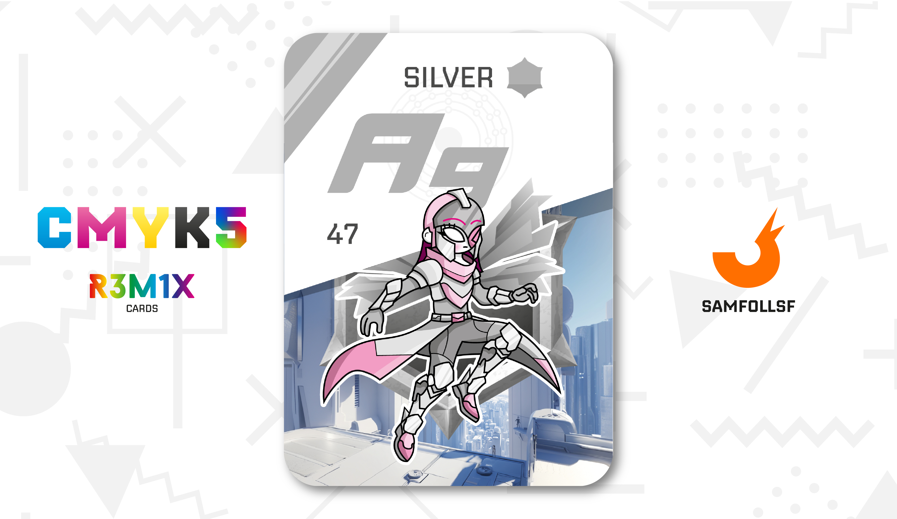
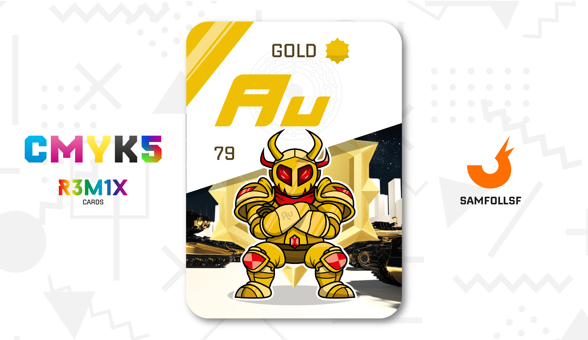
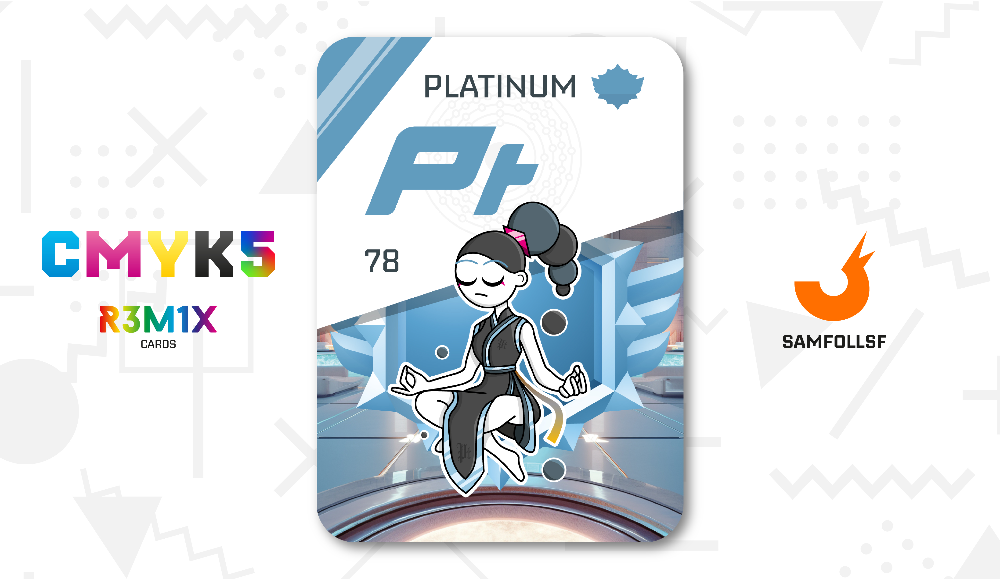

# Metalli Nobili

Nel WebVerse esiste una vasta varietà di metalli, tra cui alcuni estremamente rari e potenti, che hanno dato origine a veri e propri miti. Questi materiali, noti come "Metalli Nobili," sono riservati esclusivamente a utilizzi specificamente autorizzati dal governo. Di conseguenza, il loro possesso è considerato illegale per chiunque non disponga di un valido motivo o permesso ufficiale.

## Bronzo

Il rame è un metallo fondamentale per le comunicazioni nel [Surface Web](../Remix/deep.md), utilizzato principalmente in infrastrutture come gallerie e connessioni elettriche, ben rappresentate nella carta. Il suo mito è incarnato dal Cavalier di Rame, un soldato altamente disciplinato, al servizio dei metalli più potenti. Questi cavalieri sono piuttosto diffusi nel [Surface Web](../Remix/deep.md) e hanno il compito di mantenere l'ordine pubblico, segnalando eventuali crimini agli altri membri della loro rete.

Il loro design si ispira all'estetica dei cavalieri tradizionali, ma con un tocco futuristico: un elmetto high-tech che integra la realtà aumentata per visualizzare informazioni in tempo reale. Gli elmetti sono inoltre dotati di antenne, garantendo comunicazioni efficienti sia tra gli altri cavalieri che con il governo.

- Numero Atomico: 29.

## Argento

Gli Angeli Argentati sono noti per la loro incredibile agilità e abilità nei combattimenti aerei grazie alle loro ali metalliche. Il mito che li rappresenta è una figura femminile snella, la cui armatura riduce al minimo le forme tradizionalmente femminili, senza però intaccare la loro personalità. L'essenzialità è un elemento chiave del loro design, motivo per cui indossano sempre un copri occhio su uno dei loro occhi, inizialmente usato per proteggerlo e utilizzarlo solo nei momenti cruciali. Oggi, questo dettaglio è diventato più un simbolo.

Il loro ruolo principale è trasferire piccole quantità di bit a velocità elevate, fungendo da corrieri rapidi ed efficienti attraverso il [Surface Web](../Remix/deep.md). Sebbene il loro nome, il loro design è più ispirato all'estetica dei gladiatori che a quella degli Angeli.

(Carta interpretata da [Katia](../Remix/extraspettrale.md))

- Numero Atomico: 47.

## Oro

Il Bruto Dorato ha il delicato compito di monitorare e controllare gli Agent e i Manager che accedono al [Deep Web](../Remix/metal.md) per consultare i propri archivi di password e altri dati sensibili. Questa regione del Web è infatti altamente militarizzata e sottoposta a un rigido controllo.

Questi soldati, dotati di una forza bruta, hanno l'ordine di eliminare chiunque tenti di attraversare i confini militarizzati, specialmente coloro che cercano di passare dal [Deep Web Nascosto](../Remix/deep.md) a quello esposto. Il loro ruolo è fondamentale per garantire la sicurezza e l’integrità dei dati sensibili, seguendo le direttive imposte dal governo.

Il loro design richiama vagamente quello di un Samurai Oni.

(Carta interpretata da [Kyle](../Remix/extraspettrale.md))

- Numero Atomico: 79.

## Platino

Il Platino è il metallo più potente di tutto il Web, considerato una risorsa inestimabile e strettamente custodita sia dal Governo che dai suoi proprietari privati. La sua potenza è leggendaria: un’arma da fuoco realizzata con frammenti di Platino è in grado di abbattere fino a 25 Bruti Dorati con un solo caricatore. Tuttavia, il Platino è anche estremamente instabile, motivo per cui viene utilizzato solo in forma di frammenti e mai per forgiare interamente armi o armature.

Ad oggi, nessuno nel Web ha mai avuto accesso a una quantità di Platino sufficiente per creare equipaggiamenti completamente forgiati in questo metallo, ma chiunque ci riuscisse diventerebbe senza dubbio uno degli esseri più potenti mai esistiti.

La straordinaria forza del Platino non si limita all’ambito fisico ma si estende anche a quella interiore e spirituale, dando origine a un vero e proprio [Culto Religioso](../Nero/bird.md) che circonda questo metallo.

Ma quindi il mito qui qual è? Non ne esiste uno soltanto ma molteplici. Quello visto nella carta è EmmeElle, figura di speranza e di rispetto. Quello che dovete sapere è che nel caso del Platino i miti servono più per dare una facciata positiva al metallo, che inizialmente fu visto come una grande minaccia dalla popolazione del Web. Oggi le cose sono migliorate ma l'opinione pubblicca è divisa in due: chi appoggia l'idea di avere un metallo così potente e chi ne vorrebbe l'estinzione.

- Numero Atomico: 78.

# Versione Mazzo 1.0