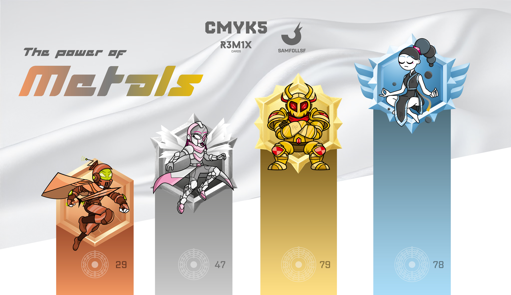
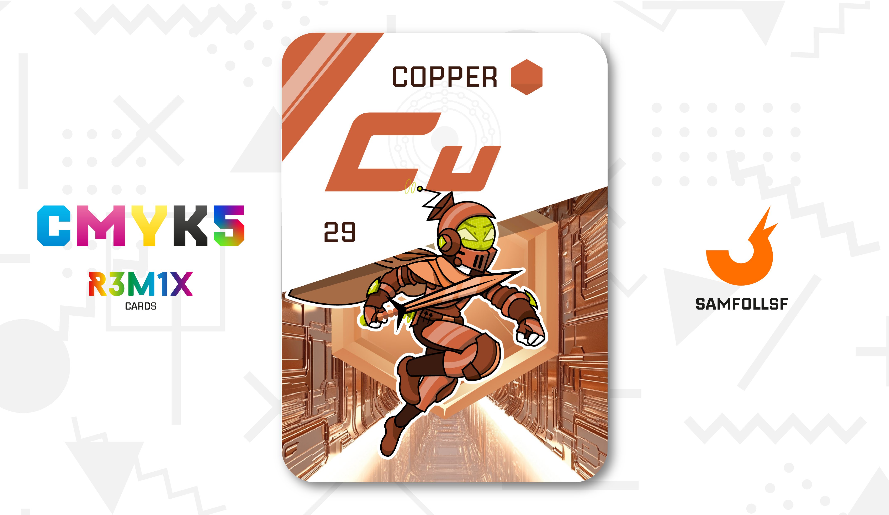
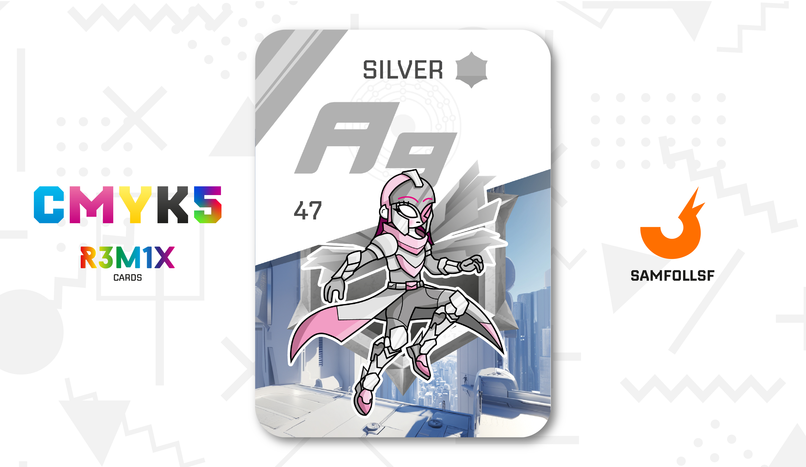
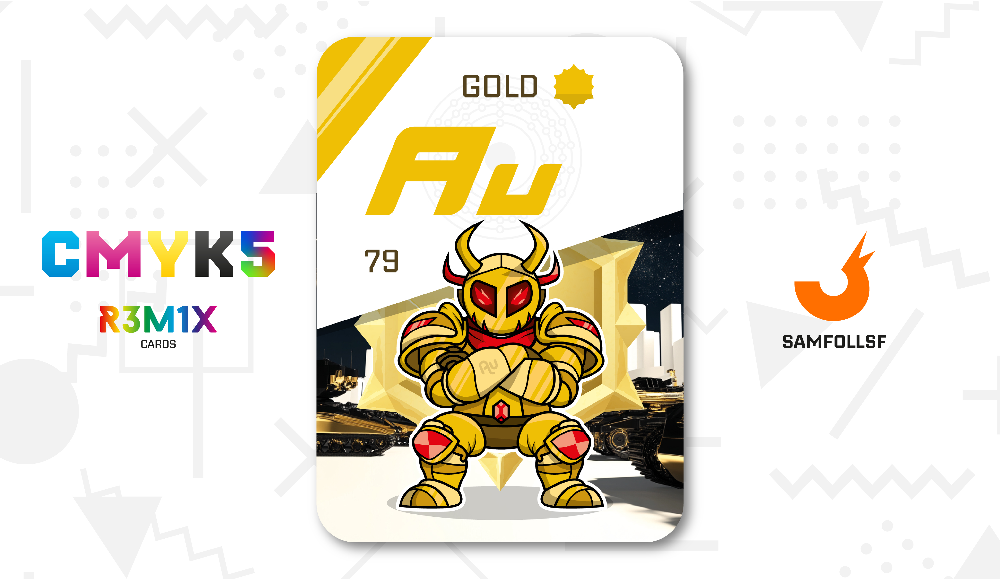
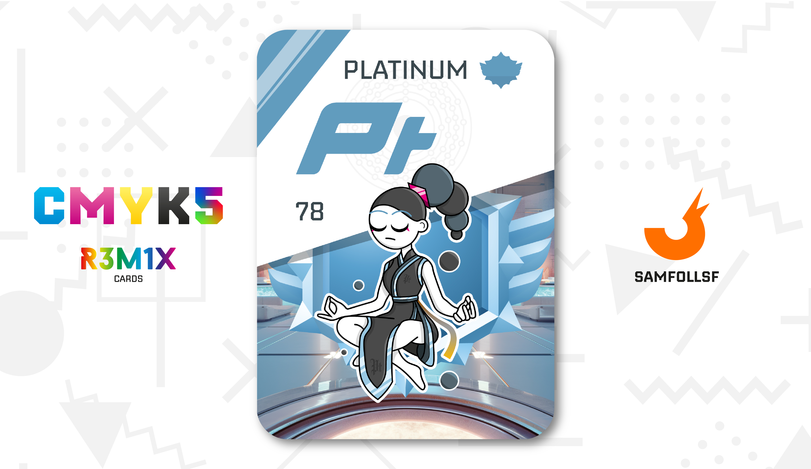

# Metalli Nobili

Nel WebVerse esiste una vasta varietà di metalli, tra cui alcuni estremamente rari e potenti, che hanno dato origine a veri e propri miti. Questi materiali, noti come "Metalli Nobili," sono riservati esclusivamente a utilizzi specificamente autorizzati dal governo. Di conseguenza, il loro possesso è considerato illecito per chiunque non disponga di un valido motivo o permesso ufficiale.

## Rame

Il Rame è un metallo fondamentale per le comunicazioni nel [Surface Web](../Remix/deep.md), utilizzato principalmente in infrastrutture come gallerie e connessioni elettriche, ben rappresentate nella carta. Il suo mito è incarnato dal Cavalier di Rame, un soldato altamente disciplinato, al servizio dei metalli più potenti. Questi cavalieri sono piuttosto diffusi nel [Surface Web](../Remix/deep.md) e hanno il compito di mantenere l'ordine pubblico, segnalando eventuali crimini agli altri membri della loro rete.

Il loro design si ispira all'estetica dei cavalieri tradizionali, ma con un tocco futuristico: un elmetto high-tech che integra la realtà aumentata per visualizzare informazioni in tempo reale. Gli elmetti sono inoltre dotati di antenne, garantendo comunicazioni efficienti sia tra gli altri cavalieri che con il governo.

In combattimento usano la loro proprietà conduttiva per scaraventare fulmini e scariche elettriche folgoranti ai propri nemici. Il loro tallone d'achille è l'assenza di resistenza in acqua e la mancanza di tolleranza a sbalzi di tensione imporvissi e incontrollati, rendnedosi appetibili per lo [Smeraldo](../Remix/crystal.md)

- Numero Atomico: 29.

(Controparte difensiva: [Alluminio](../Magenta/shadowelite.md))

## Argento

Gli Angeli Argentati sono noti per la loro incredibile agilità e abilità nei combattimenti aerei grazie alle loro ali metalliche. Il mito che li rappresenta è una figura femminile snella, la cui armatura riduce al minimo le forme tradizionalmente femminili, senza però intaccarne la femminilità. L'essenzialità è un elemento chiave del loro design, motivo per cui indossano sempre un copri occhio su uno dei loro occhi, inizialmente usato per proteggerlo e utilizzarlo solo nei momenti cruciali. Oggi, questo dettaglio è diventato più un simbolo.

Il loro ruolo principale è trasferire piccole quantità di bit a velocità elevate, fungendo da corrieri rapidi ed efficienti attraverso il [Surface Web](../Remix/deep.md). Sebbene il loro nome, il loro design è più ispirato all'estetica dei gladiatori che a quella degli Angeli.

In combattimento l'Argento è usato per via delle sua leggerezza, usando armi in ECMAScript in picchata per evere una potenza all'impatto devastante. Tuttavia, nonostante la loro forbidabile resistenza alle scariche elettriche, gli Angeli Argentati devono vedersela con la loro controparte cristallina, lo [Zaffiro](../Remix/crystal.md): abbassare la guardia contro i cursori fatti di questa gemma può essere fatale.

(Carta interpretata da [Katia](../Remix/extraspettrale.md))

- Numero Atomico: 47.

(Controparte difensiva: [Ferro](../Magenta/shadowelite.md))

## Oro

Il Bruto Dorato ha il delicato compito di monitorare e controllare gli Agent e i Manager che accedono al [Deep Web Esposto](../Remix/metal.md) per consultare i propri archivi di password e altri dati sensibili. Questa regione del Web è infatti altamente militarizzata e sottoposta a un rigido controllo.

Questi soldati, dotati di una forza bruta, hanno l'ordine di eliminare chiunque tenti di attraversare i confini militarizzati, specialmente coloro che cercano di passare dal [Deep Web Nascosto](../Remix/deep.md) a quello esposto e viceversa. Il loro ruolo è fondamentale per garantire la sicurezza e l’integrità dei dati sensibili.

Sono estremamente pericolosi, ma anche dannatamente lenti nei movimenti. Questa lentezza può essere sfrutata dai [Rubini](../Remix/crystal.md) per violare la loro armature tramite piccole fessure e prendere il controllo di tutta l'armatura dorata.

Il loro design richiama vagamente quello di un Samurai Oni.

(Carta interpretata da [Kyle](../Remix/extraspettrale.md))

- Numero Atomico: 79.

(Controparte difensiva: [Mercurio](../Magenta/shadowelite.md))

## Platino

Il Platino è il metallo più potente di tutto il Web, una risorsa dall'inestimabile valore e gelosamente custodita sia dal Governo che dai suoi proprietari privati. La sua potenza è leggendaria: un’arma da fuoco realizzata con frammenti di Platino è in grado di abbattere fino a 25 Bruti Dorati con un solo caricatore. Tuttavia, il Platino è anche estremamente instabile, motivo per cui viene utilizzato solo in purezze piuttosto basse nella realizzzione di equipaggiamenti.

Ad oggi, nessuno nel Web ha mai avuto accesso a una quantità e purezza di Platino sufficiente per creare armature forgiati in questo metallo al 100%, ma chiunque ci riuscisse diventerebbe senza dubbio uno degli esseri più potenti mai esistiti.

#### Purezza al 60%

Il Platino a questo livello di purezza è la naturale controparte del [Diamante Azzurro](../Remix/crystal.md). Oltre alla sua peculiarità unica, questo metallo comprende il potere di tutti gli altri tre metalli precedenti (conduzione elettrica, volo e forza bruta) ma portati ad livello ancora superiore. Il quarto potere unico del Platino (che parte da questa purezza e man mano che si aumenta diventa più raffinato) è quello di creare ogni oggetto presente nel Web. Per ogni oggetto intendo tutti, può creare un intero palazzo e scaraventarlo contro un obiettivo, può costruire un veicolo inedito per un combattimento specifico, un campo di tesle con cui sprigionare fulmini e così via.

C'è però un limite importante: non può creare Metalli Nobili o [Web Crystal](../Remix/crystal.md). Tutto il resto sì, di qualsiasi forma e dimensione. Oviiamente più la creazione è densa di informazioni e più tempo ci vorrà per completare il compito.

(Controparte difensiva: [Titanio](../Magenta/shadowelite.md))

#### Purezza al 80%

Da questa purezza, che ricordo essere biomeccanicamente insostenibile per gli abitanti del Web, è possibile creare anche i Metalli Nobili, dal Rame all'Oro. Qui la storia cambia radicalmente. L'efficienza è portata a livelli clamorosi, creare grattacieli fatti d'oro e annientare interi network diventa un gioco da ragazzi.

#### Purezza al 100%

Non si hanno informazioni ufficiali su cosa sia capace di fare il Platino puro al 100%, abbandonando quindi il concetto di lega e sfruttando tutta l'essenza del suo potere. La teoria più accreditata tra gli Agent è quello di un metallo in grado di sovvergere la legge della conservazione della materia. Le leghe precedenti utilizzavano i materiali che avevano vicino per le creazioni, la purezza all'80% era capace di trasformare anche il terreno ghiacciato in Oro, cosa che la purezza al 60% non consente. Vincere sulla legge del chimico Antonie Lavoisier porta la sfida bilanciata con il [Diamante Oscuro](../Remix/crystal.md): ora non si risponde alle regole dell'universo, ma l'unico limite diventa la propria immaginazione nel creare sempre più Platino, sempre più potenza di calcolo, sempre più dati, arrivando a sfondare i limiti dello spazio del WebVerse.

A questo livello si sublima la differenza di logiche tra [Metalli Nobili](../Remix/metal.md) e Web Crystal. I primi cercando di vincere usando la forza bruta, la creazione e la resistenza. I cristalli invece seguono una logica d'astuzia sfruttando quello che già esiste, modificandolo e controllandolo, per trarne un vantaggio: un'approccio più elegante e strategico.

### Altre applicazioni

La straordinaria forza del Platino non si limita all’ambito fisico ma si estende anche a quella interiore e spirituale, dando origine a un vero e proprio [Culto Religioso](../Nero/matteowsky.md) che circonda questo metallo.

Non esiste un solo mito isolato ma molteplici. La figura presente nella carta è EmmeElle, figura di speranza e di rispetto. Quello che dovete sapere è che nel caso del Platino i miti servono più per dare una facciata positiva al metallo, che viene storicamente visto da una considerevole fetta di utenza come una seria minaccia per l'incolumità della popolazione del Web. Oggi le cose sono migliorate ma l'opinione pubblicca è ugualemnte divisa in due: chi appoggia l'idea di avere un metallo così potente e chi ne vorrebbe l'estinzione.

- Numero Atomico: 78.