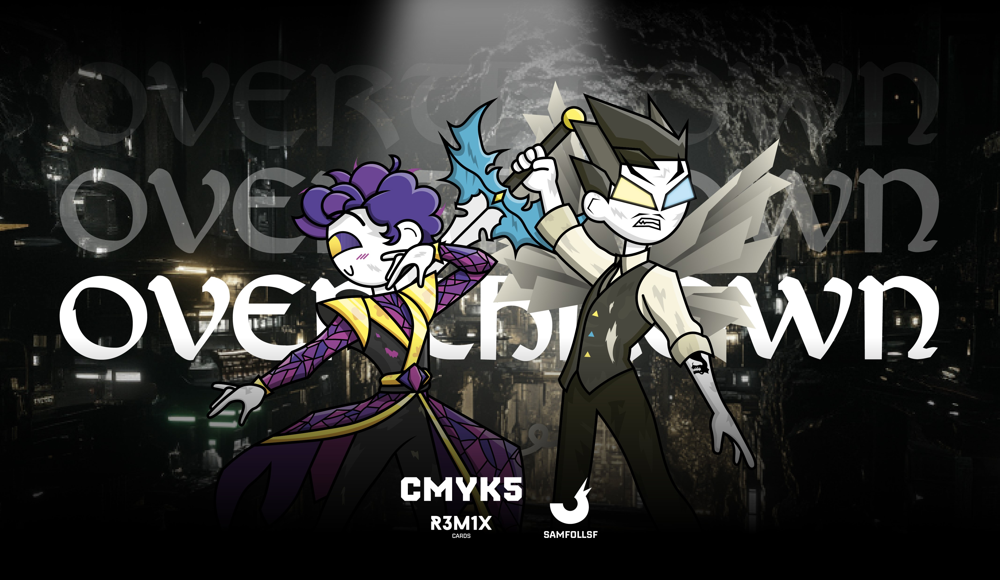

# Overthrown

Gli Overthrown sono i predecessori degli attuali Agent e Manager, account che gli esseri umani smettono di usare. Di solito, viene loro inflitta una pena di morte per contenere l'incessante crescita della popolazione nel WebVerse, ma alcuni riescono a rifugiarsi nel [Deep Web Nascosto](../Remix/deep.md). Il loro aspetto è segnato dal loro adattamento in questa regione molto scura del Web, scegliendo soluzioni come la visione notturna o l'ecolocalizzazione.

## BlaseJewel51

BlaseJewel51 è a tutti gli effetti il fratello maggiore di [SamFollSF](../Remix/samfollsf.md) e il loro rapporto è molto complicato. Inizialmente, [SamFollSF](../Remix/samfollsf.md) sarebbe dovuto essere il mio account secondario, portando alla coesistenza di un Agent (SamFollSF) e un Manager (BlaseJewel51). Per Blase, suo fratello era la cosa più importante e se ne prendeva cura nel crudele mondo del [Surface Web](../Remix/deep.md). Dopo tanti reati commessi assieme finiranno per scontare una pena di un anno nella prigione di [Sa742sa](../Remix/sa742sa.md), il DeadLocked, per poi evadere e iniziare una vita da fuggitivi.

Tuttavia, Blase non avrebbe mai immaginato che quello che stava proteggendo sarebbe diventato la sua condanna a morte. Quando [SamFollSF](../Remix/samfollsf.md) ottenne l'esclusività come mio unico Agent, Blase attraversò una profonda crisi che lo portò a odiarlo e trattarlo male, arrivando persino a tentare di ucciderlo per rimanere in vita. Oggi, Blase ha trovato rifugio nel [Surface Web Nascosto](../Remix/deep.md), tormentato dal senso di colpa, ma sarà Sam abbastanza aperto da accettare le sue scuse?

Per percepire lo spazio attorno a sè, Blase ha sviluppato nei suoi capelli delle antenne che gli permottono di ecolocalizzare la zona, e per questo motivo è praticamente cieco, privo di iridi. Inoltre da come possiamo notare ha un paio di ali di un [Angelo Argentato](../Remix/metal.md), il come è entrato in possesso di oggetti forgiati in Argento come anche la sua spada è un elemento di trama che spiegherò in seguito.

## ExparFra

ExparFra è l'Overthrown di PostFry ed è nel [Deep Web](../Remix/deep.md) da più tempo di BlaseJewel51, anche se risulta essere meno efficace nei combattimenti. La sua personalità è in netto contrasto con l'ambiente circostante: mentre BlaseJewel51 è cinico e spietato, ExparFra è empatico e gentile, trattando anche gli altri Overthrown del luogo, pur essendo dei pezzi di merda, con una bontà che non perde mai.

Da dieci anni, insieme a Blase, cerca un modo per evadere da questa enorme prigione sotterranea. I due si bilanciano a vicenda: BlaseJewel è la parte spietata e potente, un'anima corrotta dal male del [Deep Web](../Remix/deep.md), mentre ExparFra rappresenta la parte buona, che riflette dieci volte prima di agire o uccidere qualcuno.

A differenza di Blase egli ha deciso di percorrere la strada della visione notturna, e inoltre il suo vestito è composto da tutti i [Web Crystals](../Remix/crystal.md) che ha trovato nel [Deep Web](../Remix/deep.md) durante gli anni.

# Versione Mazzo 1.0