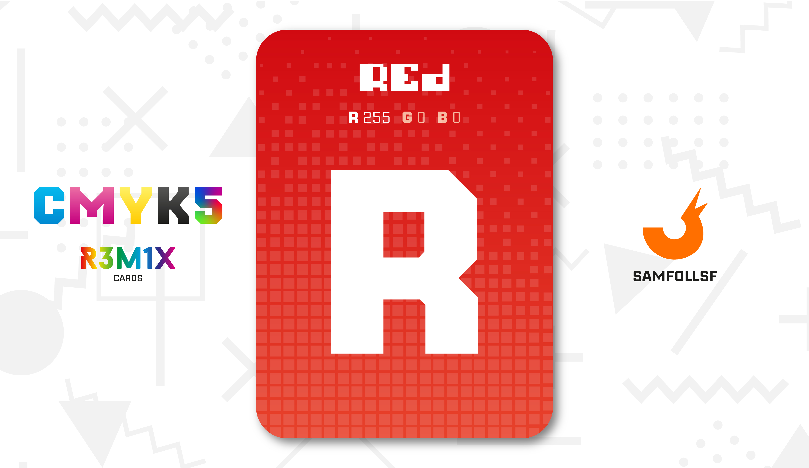
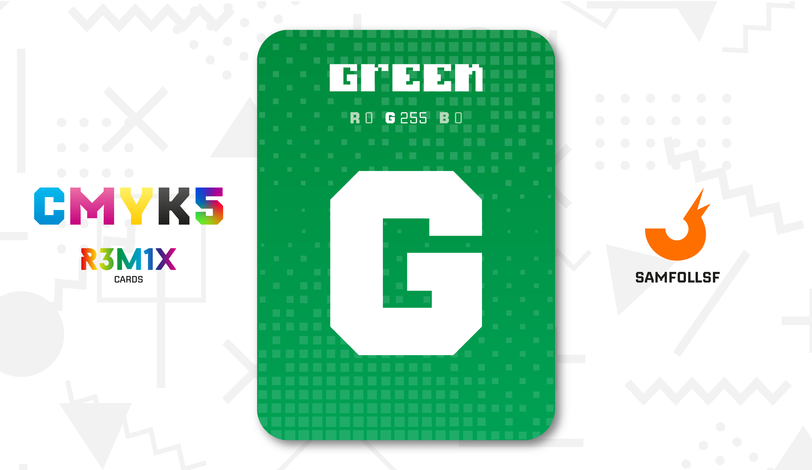
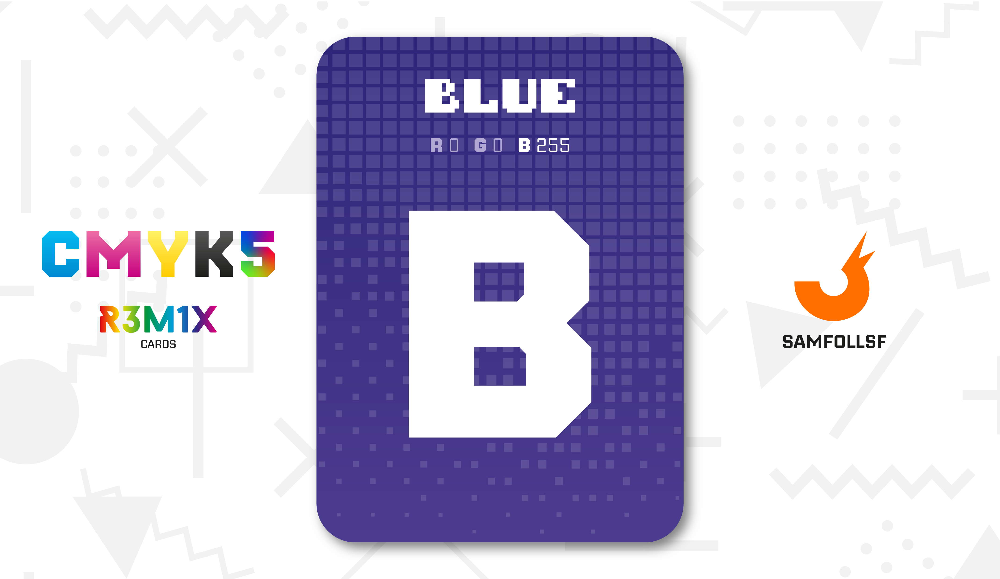
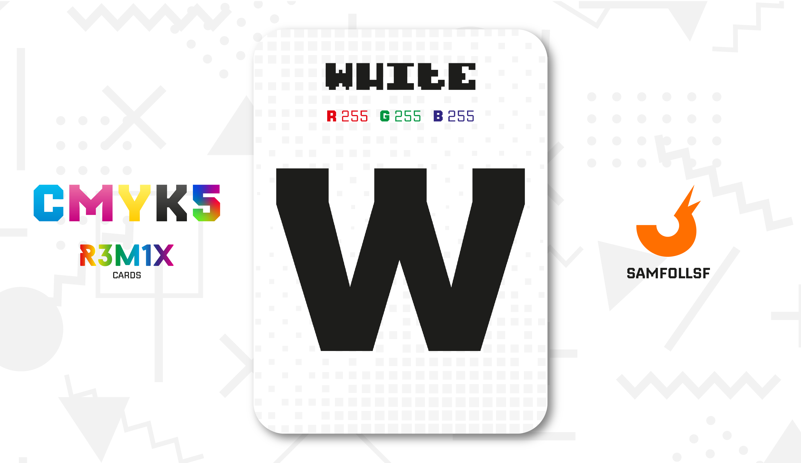

# Rgb

Le carte RGB rappresentono la sintesi additiva, usata per riprodurre i colori sui display di Computer, Telefoni e Televisori. A differenza della sintesi sottrattiva qui l'aggiunta di colori incrementa la luce, dando il Bianco come risultato dell'unione dei 3 colori primari.

## Rosso

Nei primi display a pixel, il rosso era spesso il colore dominante nelle configurazioni per garantire un’illuminazione uniforme, dato il suo ruolo centrale nella percezione visiva.

## Verde

I dispositivi di visione notturna spesso usano il verde per rappresentare immagini in scala, poiché il nostro occhio lo percepisce meglio al buio rispetto ad altri colori.

## Blu

Il blu è il colore a cui i nostri occhi sono meno sensibili rispetto al rosso e al verde. Questo è il motivo per cui nei vecchi schermi CRT (a tubo catodico) le informazioni del blu erano trasmesse con meno dettagli per risparmiare dati, senza che l'occhio umano percepisse la differenza.

## Bianco

Il Bianco non fa parte dei colori primari della sintesi additiva, ma ho deciso di includerlo ugualmente, in quanto è il risultato di tutti e tre i colori messi insieme.

# Versione Mazzo 1.0