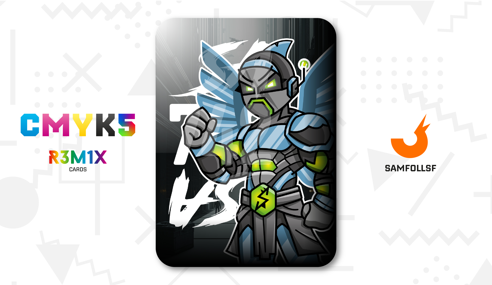

---
tags:
  - DeadLocked

...

# Sa742sa

Il direttore della prigione più grande del Network 742: il DeadLocked, conosciuto come Sa742sa o semplicemente "Sasa", è una figura enigmatica e spietata. In questa prigione, [SamFollSF](../Remix/samfollsf.md) e suo fratello [BlaseJewel51](../Remix/over.md) hanno scontato una pena di un'anno per frode legata all'equipaggiamento in Bronzo appartenente alla stessa struttura. Ha tentato per il primo anno di riacciufarli, ma poi ha aspettato che le leggi del Web avrebbero fatto il lavoro sporco per lui, e mi riferisco alla fuga di [BlaseJewel51](../Remix/over.md) nel [Deep Web](../Remix/deep.md).

Tuttavia, Sasa nasconde un oscuro segreto nei livelli più profondi della sua prigione. Dal piano -31 in giù, invece di celle per prigionieri, si trovano laboratori top secret dove oltre 120 scienziati conducono esperimenti senza scrupoli. I detenuti condannati a morte o con pene superiori ai 10 anni vengono utilizzati come cavie per le ricerche più macabre e assurde. Un esempio? Testare quanto può sopravvivere un Agent infettato da 10 Parassiti Metallizzati contemporaneamente (tempo registrato: 2,38 secondi prima del decesso).

Tuttavia, il progetto più importante si svolge al livello più profondo della struttura: trovare il [Diamante Rosso](../Remix/crystal.md) e portare il [Platino](../Remix/metal.md) al 100% della sua purezza, diventando così il Manager più potente di tutto il WebVerse.

# Volume IX: DEADLOCKED