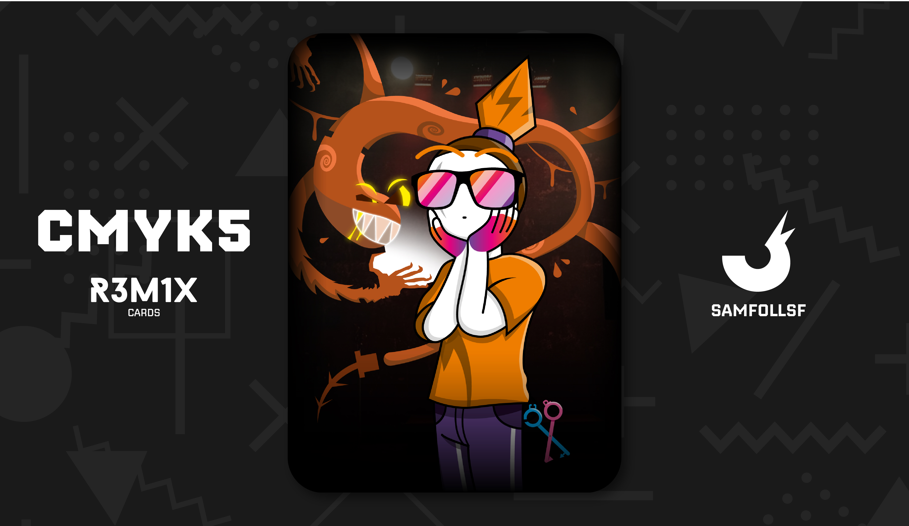
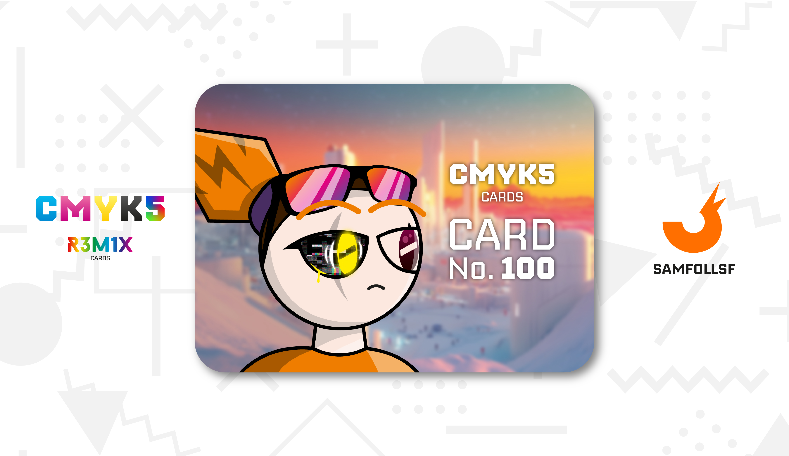

---
tags:
  - 87

...

# SamFollSF

## Descrizione

Arriviamo al mio Agent, SamFollSF. Si tratta di un personaggio cruciale nella trama del Mazzo, come avrete notato leggendo le descrizioni delle altre carte. Ribadisco che Agent e Persona reale sono due entità completamente diverse, e dal punto di vista caratteriale non hanno nulla in comune. Sam non fa eccezione.

In poche parole, SamFollSF è uno psicopatico criminale, un assassino spietato ricercato vivo o morto dal Governo. La sua infanzia è stata tutt’altro che felice, senza una famiglia che gli volesse bene, fatta eccezione per [BlaseJewel51](../Remix/over.md). Ha trascorso i primi anni della sua vita in una struttura in cui i ragazzi venivano cresciuti come topi da laboratorio, per impedire che un giorno potessero vendicarsi sui loro aguzzini. Ancora oggi, Sam non ricorda il luogo in cui è cresciuto: era troppo piccolo per conservarne memoria. L’unico ricordo nitido è la fuga da quel posto insieme a [BlaseJewel51](../Remix/over.md), un evento che avrebbe segnato l’inizio di una vita dura e complicata.

Con il passare degli anni, [BlaseJewel51](../Remix/over.md) non ha mai rivelato al fratello dove fossero cresciuti, temendo che quest'ultimo  potesse cercare quel luogo per distruggerlo. Era ben consapevole che quella missione sarebbe stata un suicidio: quel posto era molto più potente di loro.

Come già accennato nella carta di [BlaseJewel51](../Remix/over.md), la vita da fuggitivi e latitanti di Sam iniziò quando i due evaserono insieme dal [DeadLocked](../Remix/sa742sa.md), la prigione più grande del blocco 51, con a capo [Sa742sa](../Remix/sa742sa.md). Tuttavia, nella carta di [BlaseJewel51](../Remix/over.md) si parlerà anche del declino del loro rapporto. Oggi Sam non ha idea di dove sia suo fratello e, a dirla tutta, non gli importa. Anzi, spera che sia già morto.

Sam è in possesso di una [Forbice Copypasta](../Remix/tool.md), rubata a un contrabbandiere di programmi Adobe nel 2021. Quando quest’ultimo si rifiutò di cedergliela, Sam non esitò a ucciderlo. La sua spietatezza non conosce limiti: è disposto a fare qualunque cosa pur di raggiungere i suoi obiettivi. Tuttavia, ciò che Sam non sapeva è che quel contrabbandiere era un uomo di [Sa742sa](../Remix/sa742sa.md). Una volta che il titolare della prigione del Blocco 51 venne a conoscenza dell’omicidio, le ricerche per catturare SamFollSF ripresero lentamente.

Con una personalità così malvagia e crudele, Sam non poteva che collezionare una folta schiera di nemici e persone determinate a ucciderlo. E questi sono solo alcuni dei casini in cui si è cacciato:

- SamFollSF è un caso ancora aperto nel padiglione "Ricercati e Dispersi" della [Web Intelligence](../Remix/deep.md), sotto la supervisione di [Angy](../Giallo/angy.md).

- È evaso dalla prigione più grande del Blocco 51, il [DeadLocked](../Remix/sa742sa.md) dove avrebbe dovuto scontare due anni di reclusione. Tuttavia, a causa della sua fuga, se venisse catturato nuovamente, la pena salirebbe a sei anni, includendo un anno aggiuntivo per il periodo non scontato. Attualmente, sulle sue tracce si trova [Sawako](../Magenta/sawako.md), motivata a porre fine a questa storia.

- Dopo un violento litigio con [Red Ghost](../Giallo/redghost.md), scaturito dal fallimento di un’attività che i due avevano avviato insieme e che era stata rovinata da Sam, i due non si parlano da circa due anni. Se dovessero incontrarsi di nuovo, non esiterebbero a combattere.

- Nell’autunno del 2023, Sam ha tentato di assassinare [OpsGiuly](../Nero/opsg.md) per impossessarsi della sua [Chiave Quadridimensionale](../Remix/tool.md). Tuttavia, a causa della propria spavalderia, aveva sottovalutato l’avversario. Ora si trova costretto a combattere non solo contro OpsG, ma anche contro i suoi alleati.

- Sam è in debito di un diamante con la [Snoctix.Inc](../Magenta/solisnoctix.md), una situazione complicata che non sa come risolvere. Questo elemento di trama sarà approfondito in futuro.

Il vero declino nella vita di SamFollSF avviene nel 2020, quando decide di unirsi alla Lega di Bronzo, una setta riservata a chi ha il coraggio di integrare nella propria vita una S Pen metallizzata, il rituale inizale per accedervi (quella che indossa sulla schiena).

All’inizio, Sam non sembra affatto intimorito, almeno fino a quando non scopre la vera natura di quelle penne. Apparentemente si presentano come semplici oggetti inanimati, armi di supporto. Ma nel momento esatto in cui ne tocca una per la prima volta, la verità gli si rivela: non si tratta solo di penne, ma di esseri viventi. Sono Malware, parassiti metallizati, incarnazione della sua più grande fobia.

Da quel giorno, il parassita si insedia nel corpo di Sam, prendendo il controllo e influenzando molte delle sue scelte e diventando l’artefice della sua spietatezza. È stato il parassita a orchestrare il tentato omicidio di [OpsGiuly](../Nero/opsg.md), poi fallito. È sempre lui la causa del litigio con [Red Ghost](../Giallo/redghost.md). Nonostante ciò tutte le malefatte sono state comunque approvate da Sam, rendendolo colpevole e assolutamente non innocente.

Se solo provasse a ribellarsi, il parassita, che ha accesso diretto alle sue componenti vitali, potrebbe prendere il controllo completo del suo corpo e, nel peggiore dei casi, porre fine alla sua vita in un istante.

Ora il nostro SamFollSF non è solo nei guai con gli altri, ma anche con se stesso. Riuscirà a sconfiggere il suo male interiore e a riappacificarsi con i suoi nemici? Oppure, perché no, deciderà di uccidere anche loro? La trama è ancora in una fase primordiale, quindi tutto può cambiare, e il suo sviluppo è ancora in lavorazione. Al momento, non prevedo un testo definitivo o un’opera che possa essere considerata un sequel delle carte prima del 2027, ma mai dire mai.

In ordine cronologico, questa è la 100ª carta, anche se sul sito è posizionata prima per motivi di ordinamento alfabetico. Come chicca finale, è possibile vedere SamFollSF per la prima volta senza occhiali: uno dei suoi occhi è stato accecato dal parassita.

## Curiosità
- Usa un linguaggio molto scurrile, anche se nelle carte non assistiamo mai a un dialogo. In futuro con la scrittura della trama sarà tutto più evidente.
- Egli porta il codino da molto prima del 2020, anno in cui anche io avevo i capelli così lunghi.
- Vive in un attico del mio Adobe Illustrator, luogo in cui hanno origine le carte.
- Indossa gli occhiali da sole per nascondere la sua identità e per evitare di far riconoscere il suo tratto distintivo.
- Riesce a guadagnare molti soldi dall'Import-Export dal [Surface al Deep Web](../Remix/deep.md) di materiale per disegnare con i programmi Adobe.
- La sua arma, la S Pen Mystic Bronze, è in grado di mutare la sua forma, potendo diventare una pistola, un fucile, un bazooka, un'ascia, una mazza e così via al momento del bisogno in modo molto dinamico.
- SamFollSF è l'Agent dell'autore delle Carte CMYK5, ovvero io Samuele Follera. Grazie per l'attenzione.

# Versione Mazzo 1.0