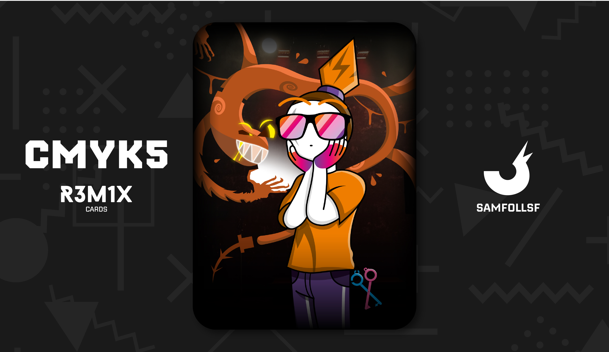
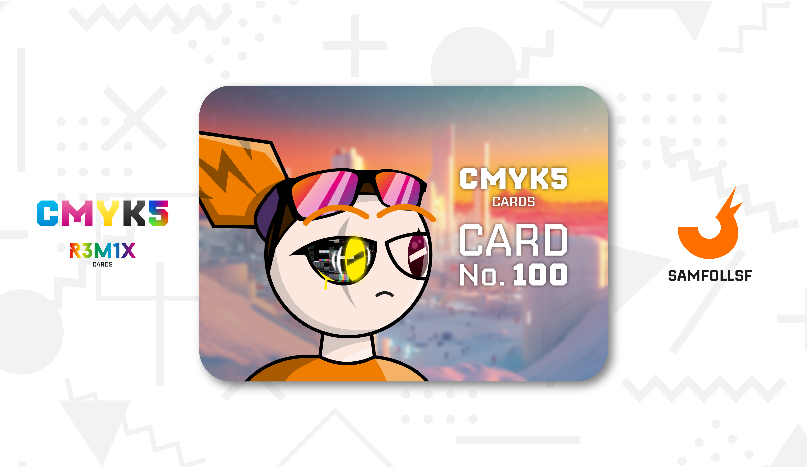

---
tags:
  - 87

...

# SamFollSF

## Descrizione

Arriviamo al mio Agent, SamFollSF, originario del Network 87 a Saint Armand. Si tratta di un personaggio cruciale nella trama del Fumetto e Mazzo, come avrete notato leggendo le descrizioni delle altre carte. Ribadisco che Agent e Persona reale sono due entità completamente diverse, e dal punto di vista caratteriale non hanno nulla in comune. Sam non fa eccezione.

In poche parole, SamFollSF è uno psicopatico criminale, un assassino spietato ricercato vivo o morto dal Governo. La sua infanzia è stata tutt’altro che felice, senza una famiglia che gli volesse bene, fatta eccezione per suo fratello [BlaseJewel51](../Remix/over.md). Entrambi hanno passato i primi anni di vita nel Network 742.

Dopo l'evasione dal [Deadlocked] con [BlaseJewel51](../Remix/over.md),  inizieranno una vita criminale insieme, nella costante fuga dalle forze dell'ordine, la quale si concluderà in modo doloroso per entrambi: nella carta di [BlaseJewel51](../Remix/over.md) si parlerà anche del declino del loro rapporto. Oggi Sam non ha idea di dove sia suo fratello e, a dirla tutta, non gli importa. Anzi, spera che sia già morto.

Sam è in possesso di una [Forbice Copypasta](../Remix/tool.md), rubata a un contrabbandiere di programmi Adobe nel 2021. Quando quest’ultimo si rifiutò di cedergliela, Sam non esitò a farlo secco. La sua spietatezza non conosce limiti: è disposto a fare qualunque cosa pur di raggiungere i suoi obiettivi. Tuttavia, ciò che Sam non sapeva è che quel contrabbandiere era un uomo di [Sa742sa](../Remix/sa742sa.md).

Con una personalità così malvagia e crudele, Sam non poteva che collezionare una folta schiera di nemici e persone determinate a ucciderlo. E questi sono solo alcuni dei casini in cui si è cacciato:

- SamFollSF è un caso ancora aperto della [Web Intelligence](../Remix/deep.md), sotto la supervisione di [Angy](../Giallo/angy.md). (Volume III: FREAK-LEADER)

- Evase dalla prigione più grande del Network 742, il [DeadLocked](../Remix/sa742sa.md). Tuttavia, a causa della sua fuga, se venisse catturato nuovamente, dovrebbe scontare una pena di dieci anni. Attualmente, sulle sue tracce si trova [Sawako](../Magenta/sawako.md), motivata a porre fine a questa storia. (Volume VIII: BIG LIE)

- Nell'autunno del 2023, Sam e [OpsGiuly](../Nero/opsgiuly.md) verranno catturati dall'operazione [Red Winter](../Magenta/alesdreams.md) per il possesso illecito di [Strumenti dei Fondatori](../Remix/tool.md). La loro forzata alleanza per risolvere questa faccenda avrà effetti devastanti per entrambi. (Volume IV: RED WINTER)

- SamFollSf è in tensione con la [Snoctix.Inc](../Magenta/solisnoctix.md), dopo aver cercato di violare la console per il tracciamento di dati sensibili di [Brioche33](../Magenta/brioche33.md) e [PickMeGiuls](../Ciano/pickmegiuls.md). [Solisnoctix](../Magenta/solisnoctix.md) come il suo solito avrebbe semplicemnte fatto fuori la minaccia di turno, ma SamFollSF aveva un asso nella manica, rendendo la storia tra vincitore e un vinto più arzigogolata del dovuto. (Volume VI: BE OKAY)

Il vero declino nella vita di SamFollSF avviene nel 2020, quando decide di unirsi alla "Lega Rame" dopo un misterioso invito, una setta riservata a chi ha il coraggio di integrare nella propria vita una S Pen metallizzata, (quella che indossa sulla schiena).

All’inizio, Sam non sembrava affatto intimorito, almeno fino a quando non scoprì la vera natura di quelle penne. Apparentemente si presentano come semplici oggetti inanimati, armi di supporto. Ma nel momento esatto in cui ne tocca una per la prima volta, la verità gli si rivela: non si trattava solo di una S pen, ma di esseri viventi. Sono Malware, parassiti metallizati, incarnazione della sua più grande paura.

Da quel giorno, il parassita si è insediato nel corpo di Sam, incarnando e spingendo al limite la sua parte più malvagia e spietata. Ribellarsi è complicato, un combattimento con un essere così insidioso è quasi sempre controproducente per entrambi, arrivando perfino alla morte dell'Agent se il parassita si stufa di lui.

Ora il nostro SamFollSF non è solo nei guai con gli altri, ma anche con se stesso. Riuscirà a sconfiggere il suo male interiore e a riappacificarsi con i suoi nemici? Oppure, perché no, deciderà di eliminare anche loro?

In ordine cronologico, questa è la 100ª carta, anche se sul sito è posizionata prima per motivi di ordinamento alfabetico. Come chicca finale, è possibile vedere SamFollSF per la prima volta senza occhiali: uno dei suoi occhi è stato accecato dal parassita.

## Curiosità

- Usa un linguaggio molto scurrile, anche se nelle carte non assistiamo mai a un dialogo. In futuro con la scrittura della trama sarà tutto più evidente.
- Egli porta il codino da molto prima del 2020, anno in cui anche io avevo i capelli così lunghi.
- Vive in un attico del mio Adobe Illustrator, luogo in cui hanno origine le carte.
- Indossa gli occhiali da sole per nascondere la sua identità e per evitare di far riconoscere il suo tratto distintivo.
- Riesce a guadagnare molti soldi dall'Import-Export dal [Surface al Deep Web](../Remix/deep.md) di materiale per disegnare con i programmi Adobe.
- La sua arma, la S Pen Mystic Bronze, è in grado di mutare la sua forma, potendo diventare una pistola, un fucile, un bazooka, un'ascia, una mazza e così via al momento del bisogno in modo molto dinamico.
- SamFollSF è l'Agent dell'autore delle Carte CMYK5, ovvero io Samuele Follera. Grazie per l'attenzione.