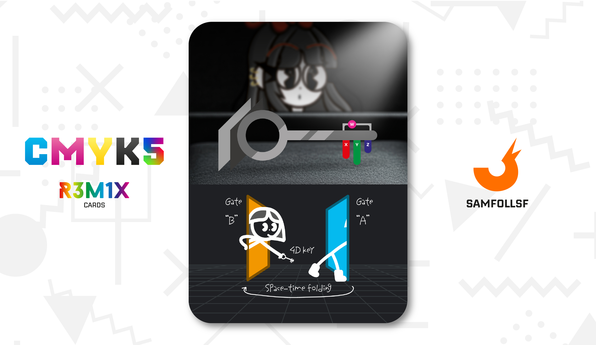
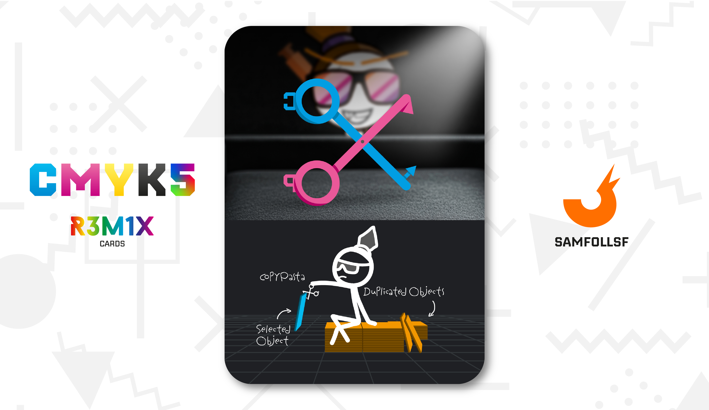
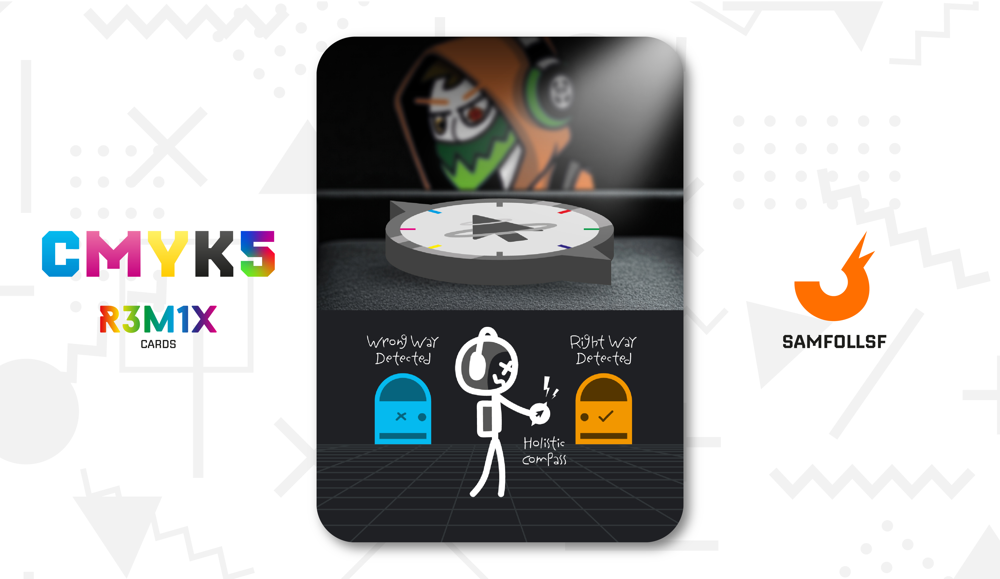

# Strumenti dei Fondatori

.jpg)

Gli Strumenti dei Fondatori furono utilizzati dai pionieri del Web per costruire l'iceberg che conosciamo oggi. Nel 1989, a Ginevra, i Fondatori, ovvero i primissimi Agent mai esistiti, vennero incaricati di decidere come distribuire le terre del Web, scegliendo liberamente la forma che preferivano. Si misero al lavoro e, grazie a migliaia di strumenti divisi in tre tipologie riuscirono a portare a termine l’impresa.

Oggi essere in possesso di uno di questi oggetti è illegalissimo, portando a conseguenza gravissime compresa la pena di morte. L'operazione [Red Winter](../Magenta/alesdreams.md) se ne sta occupando attivamente, dando la caccia agli ultimi proprietari rimasti a piede libero.

## Chiave Quadridimensionale

La Chiave Quadridimensionale consente di creare portali, noti come Whormole. In pratica, questa chiave è in grado di piegare lo spazio-tempo in un punto preciso, per poi farlo riemergere in un altro. Come illustrato nella carta, i Whormole appaiono come porte rettangolari, idealmente aperte grazie all’utilizzo della chiave.

[OpsGiuly](../Nero/opsg.md) è in possesso di una di queste chiavi.

## Forbici CopyPasta

Le Forbici CopyPasta hanno il potere di duplicare qualsiasi oggetto del Web. La forbice azzurra si occupa di copiare, mentre quella rosa incolla e quindi duplica. Tuttavia, gli oggetti duplicati hanno un limite: possono essere utilizzati una sola volta e sono estremamente fragili. Ancora oggi nessuno sa spiegare come, 30 anni fa, queste forbici siano riuscite a duplicare oggetti in modo permanente, dal momento che in un primo momento tutti gli oggetti dei fondatori furono disattivati per circa 10 anni dopo l'inaugurazione del Web e gli abitanti non furono più gli stessi.

[SamFollSF](../Remix/samfollsf.md) e [Tulipana Verde](../Giallo/del.md) sono in possesso di queste forbici.

## Bussola Olistica

La Bussola Olistica ha accesso a un databes potenzialmente infinito di informazioni. Con questo strumento e la sua immensa potenza di calcolo ci permette di sapere quale decisione prendere, se una persona sta mentendo, le conseguenze delle nostre azioni, tutto! È una vera e propria sfera di cristallo digitale.

[Post-Fry](../Giallo/postfry.md) è in possesso di una di queste bussole.

# Versione Mazzo 1.0