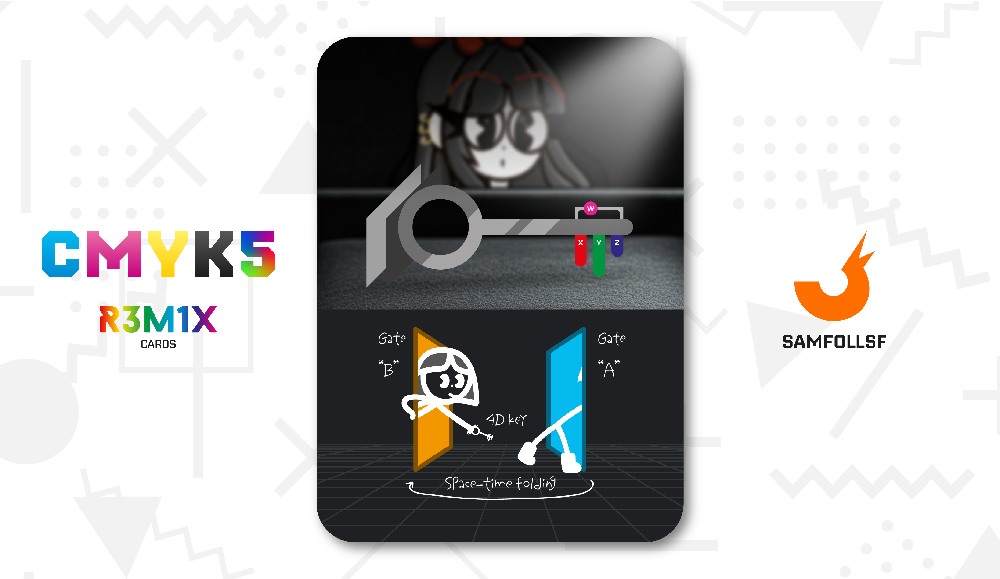
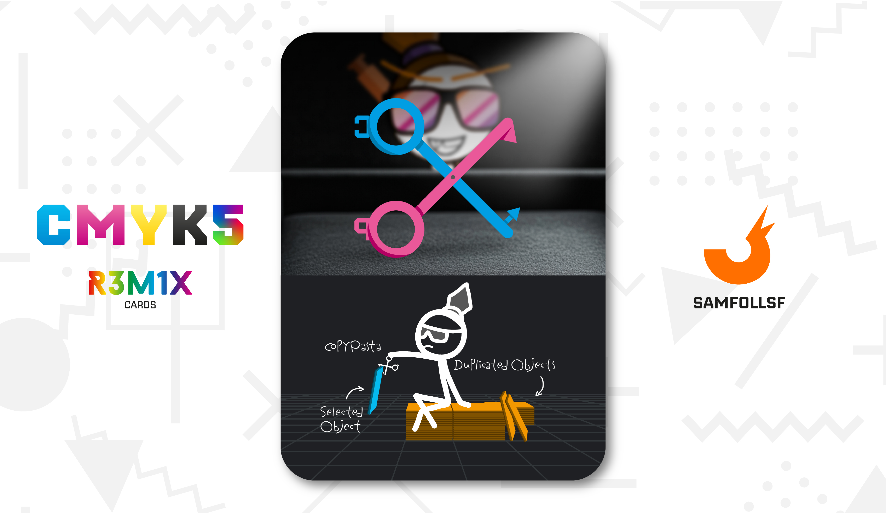
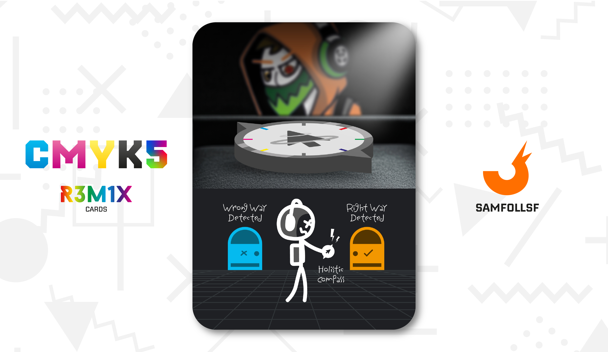

# Strumenti dei Fondatori

.jpg)

Gli Strumenti dei Fondatori furono utilizzati dai pionieri del Web per costruire l'iceberg che conosciamo oggi. Nel 1989, a Ginevra questi fondatori, ovvero i primissimi Agent mai esistiti, vennero incaricati di decidere come distribuire le terre del Web, scegliendo liberamente la forma che preferivano. Si misero al lavoro e, grazie a migliaia di strumenti divisi in tre tipologie riuscirono a portare a termine l’impresa.

Nessuno sà il perché, ma gli Strumenti dei fondatori sono tutti limitati. Essi sono corrotti e malfunzionanti, solo i fondatori del Web riuscirono a farli funzionare correttamente, ma il metodo rimane un mistero irrisolto.

Oggi essere in possesso di uno di questi oggetti è severamente vietato, portando a conseguenze gravissime compresa la pena di morte. L'operazione [Red Winter](../Magenta/alesdreams.md) se ne sta occupando attivamente, dando la caccia agli ultimi proprietari rimasti a piede libero.

## Chiave Quadridimensionale

La Chiave Quadridimensionale consente di creare portali, noti come Gate. In pratica, questa chiave è in grado di piegare lo spazio-tempo in un punto preciso, per poi farlo riemergere in un altro. Come illustrato nella carta, i Gate appaiono come porte rettangolari, idealmente aperte grazie all’utilizzo della chiave.

Per decidere dove aprire un portale è possibile inserire tutte e 4 le coordinate sulla parte finale della Chiave. Esistono due tipologie di portali: "Perpetui" e a "Farfalla". Il primo rimane aperto anche se vi ci passa dentro un Agent, il secondo si chiude subito dopo l'utilizzo, ottimo per scappare in casi di emergenza.

La limitazione delle chiave in questo stato corrotto è il limite del raggio d'azione, non è possibile aprire un Gate a distanze troppo spinte dall'origine.

[OpsGiuly](../Nero/opsgiuly.md) è in possesso di una di queste chiavi.

## Forbici CopyPasta

Le Forbici CopyPasta hanno il potere di duplicare qualsiasi oggetto del Web. La forbice azzurra si occupa di copiare, mentre quella rosa incolla e quindi duplica. È possibile clonare qualsiasi cosa, anche [Metalli Nobili](../Remix/metal.md), [Diamanti](../Remix/crystal.md) e perfino Agent interi, anche se la loro clonazione è inefficace: appena vengono generati subito scompaiono per via della loro fragilità.

Infatti, gli oggetti duplicati hanno un limite: possono essere utilizzati una sola volta e sono estremamente delicati.

[SamFollSF](../Remix/samfollsf.md) e [Tulipana Verde](../Giallo/del.md) sono in possesso di queste forbici.

## Bussola Booleana

La Bussola Booleana ha accesso a un databes potenzialmente infinito di informazioni. Con questo strumento e la sua immensa potenza di calcolo ci permette di sapere quale decisione prendere, se una strada è sicura, le conseguenze delle nostre azioni, tutto! È una vera e propria sfera di cristallo digitale.

Il limite di questo potentissimo oggetto si trova nel come vengono esposte le risposte. La bussola non può generare un testo, ma solo un "1" (Vero) oppure "0" (Falso). Curiosità: Sulla Bussola Booleana appare il blocco di testo con la risposta dettagliata, ma esso è così distorto che l'unica parte visibila è l'inizio del testo, con appunto un numero tra i due citati prima.

[Post-Fry](../Giallo/postfry.md) è in possesso di una di queste bussole.