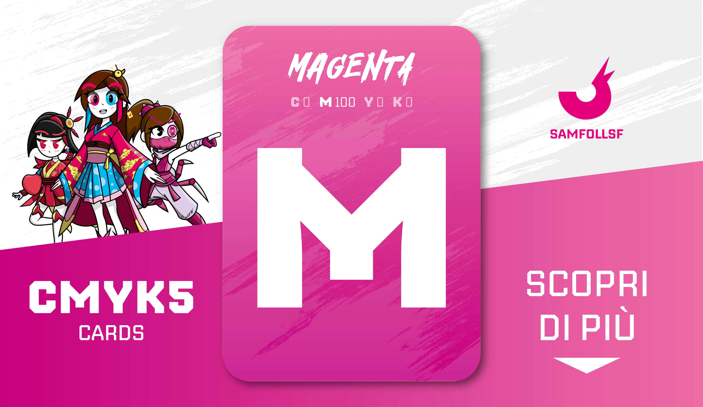

# Carta "Magenta"

Carta al 100% Magenta, indispensabile per la sintesi sottrattiva. Il tema di questo mazzo è l'arte e la pittura.

Usa la lista di Sinistra per scoprire tutte le carte dal colore prevalentemente Magenta!

## Colore

"C'era un bel dì la battaglia di Magenta..." Era precisamente il 1859, e nello stesso anno veniva riprodotto per la prima volta, chimicamente, un colore incredibile, con una tintura all'anilina chiamata "fucsina", sparato, eccessivo, che ricordava proprio il colore che doveva aver avuto il campo di quella battaglia.

# Versione Mazzo 1.0