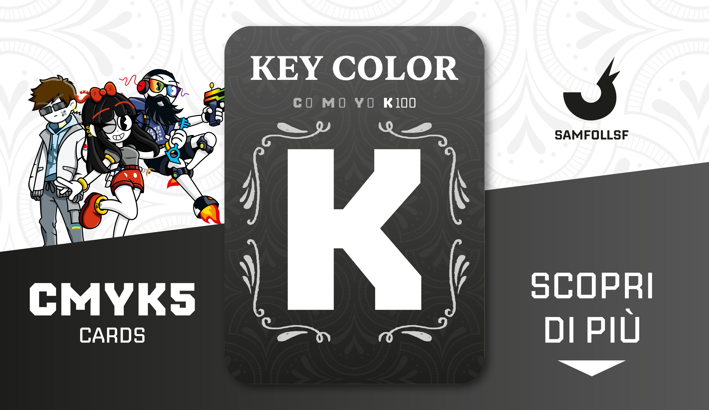

# Carta "Key Color"

Carta al 100% Nera, non indispensabile per la sintesi sottrattiva. Questo colore viene usato per risparmiare sui costi, perchè il nero si potrebbe ottenere anche dall'unione dei tre colori primari. Il tema di questo mazzo è il vintage.

Usa la lista di Sinistra per scoprire tutte le carte dal colore prevalentemente Nero!

## Colore

Tanto affascinante quanto ambiguo, ha diversi significati: dal lutto alleleganza, dalle tenebre alla modernità, dal lusso allausterità. Gli abiti neri più famosi restano il tubino di Chanel, l'abito di Audrey Hepburn in Colazione da Tiffany e il Revenge Dress di Lady Diana.

# Versione Mazzo 1.0