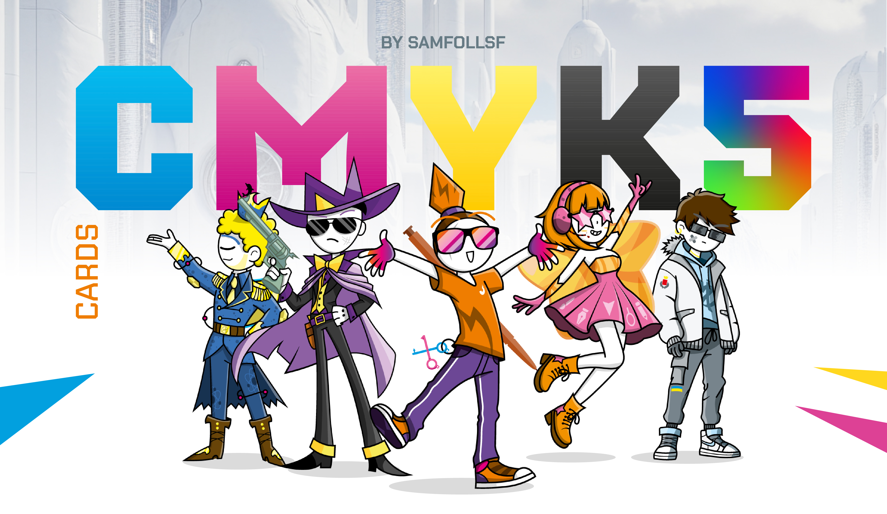
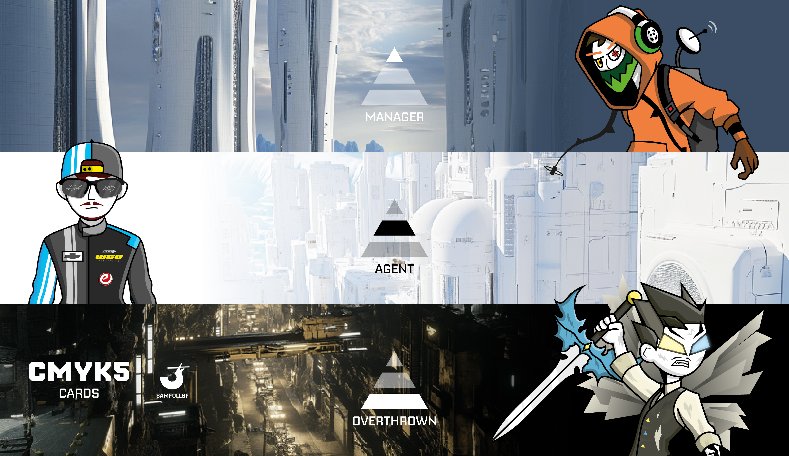
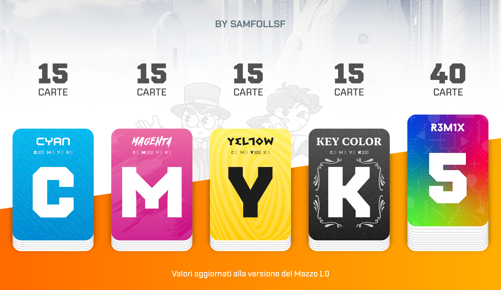
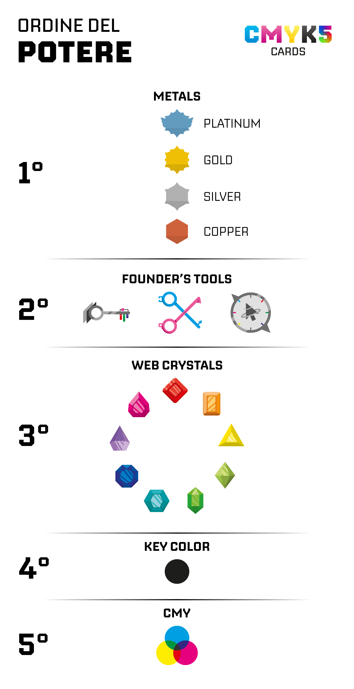

# Benvenuto

100 Carte Collezionabili divise in 5 Mazzi: Ciano, Magenta, Giallo, Key Color (Nero) e R3M1X.

Il Mazzo CMYK5 è una finestra sul WebVerse, il mondo dove le controparti digitali degli umani vivono e lavorano nel Web. Questi esserini vengono comunemente chiamati "Agent" o "Manager", stando a stretto contatto con noi senza che ci facciano sospettare di nulla. La costruzione del WebVerse si ispira all'iceberg, famosissimo modo per rappresentare l'interezza del Web. Ci sono un totale di 3 piani: [Surface Web, Deep Web e Dark Web](Remix/deep.md).

"CMYK" è l'acronimo che rappresenta i quattro colori primari della sintesi sottrattiva, il modello utilizzato nelle stampanti. Ogni mazzo di carte è associato a un tema e a un colore specifico: il mazzo Ciano include tutte le carte caratterizzate dal predominio del colore ciano, con un design minimalista e tecnologico; il mazzo Magenta, invece, si ispira al mondo della pittura e raccoglie carte prevalentemente magenta, seguendo lo stesso principio. Lo stesso vale per gli altri colori del modello quadricromico.

E il 5° mazzo? Rappresentato dal numero 5 nel nome, esso rappresenta il mazzo R3M1X, dedicato a carte che escono dai confini della sintesi sottrattiva. Qui troviamo elementi particolari come carte metalliche, ultravioletti, infrarossi e altri elementi o materiali insoliti. Più di ogni altro mazzo, il R3M1X racconta la storia che si cela dietro questa collezione, accompagnando ogni carta con una descrizione dettagliata.

## Le classi sociali

Tornando a parlare degli Agent essi sono fondamentali per permettere agli Utenti di accedere a Internet. Per capire meglio, possiamo immaginare i social Meta (Facebook, Instagram e WhatsApp) come enormi grattacieli che ospitano, in senso figurato, tutti i nostri dati organizzati in immense cassettiere. Queste cassettiere rappresentano i dati archiviati sui server distribuiti in tutto il mondo. Quest’architettura ha consentito ai Fondatori del Web, come lo conosciamo oggi, di sfruttare lavoratori operativi nel Web senza pagarli, concedendo loro in cambio solo la possibilità di esistere. Una pratica crudele che si è attenuata nel corso degli anni, dal 1980 fino a oggi, con l’emergere di diverse classi sociali.

La classe intermedia è composta proprio dagli Agent, e quindi dai lavoratori per Utenti Medi, come quelli che chiamiamo [IlPanettone](Magenta/ilpanettone.md) o [Pakolapp](Ciano/pakolapp.md). Al livello superiore troviamo i Manager, coloro che esercitano un potere amministrativo sugli Agent, simili a datori di lavoro. È qui che entrano in gioco figure come [Solisnoctix](Magenta/solisnoctix.md) o [Post-Fry](Giallo/postfry.md). Infine, sul gradino più basso, ci sono gli [Overthrown](Remix/over.md). Per ulteriori dettagli su di loro, puoi cliccare sulla scritta dedicata.

Il mio Agent è [SamFollSF](Remix/samfollsf.md), ma prima di parlare di lui preferisco lasciare spazio agli altri.

## Scopri i cinque mazzi!

Bene, ora non ti resta che scoprire tutte e 100 le carte! Usa il navigatore qui in basso o in alto per proseguire.

- [Mazzo Ciano](Ciano/carteciano.md)
- [Mazzo Magenta](cartemag.md)
- [Mazzo Giallo](cartegia.md)
- [Mazzo Nero](cartener.md)
- [Mazzo R3M1X](carterem.md)

Come si classifica il potere del WebVerse?

Sul gradino più basso troviamo la sintesi sottrattiva dei colori. Ogni Agent o Manager ha un proprio colore, che rappresenta la sua linfa vitale. Tuttavia, i colori interagiscono fra loro con bonus e malus, in modo simile al gioco "Sasso, Carta, Forbici": il Ciano contrasta il Magenta, ma subisce il Giallo; il Magenta vince sul Giallo, ma perde con il Ciano; e infine, il Giallo prevale sul Ciano, ma è battuto dal Magenta. Il Nero, invece, si trova su un livello superiore.

Al di sopra della sintesi CMY troviamo il Nero, il colore mancante. Questo colore è più forte degli altri e non segue alcuna regola di bilanciamento: è indistintamente il più potente, ma non rappresenta ancora il massimo dei poteri.

Sul gradino più basso del podio si collocano i [Web Crystals](Remix/crystal.md), ciascuno con il proprio beneficio particolare. Il più potente, almeno per ora, è il Rubino, mentre gli altri cristalli, in ordine casuale, lasciano a discrezione personale decidere quale sia più forte. Tuttavia, il cristallo più potente di tutti sarà rivelato solo nel Mazzo 1.1.

Al secondo posto troviamo gli [Strumenti dei Fondatori](Remix/tool.md): Chiavi, Forbici e Bussole. Possedere uno di questi strumenti è considerato illegale, vista la loro straordinaria potenza. Con essi è possibile teletrasportarsi, duplicare oggetti o compiere scelte sempre perfette, grazie all’immensa capacità di calcolo che offrono.

Infine, al primo posto della classifica troviamo i [Metalli Nobili](Remix/metal.md), disposti in ordine crescente: Bronzo, Argento, Oro e Platino. Quest’ultimo, il Platino, è il potere più ambito e forte dell’intero Web, conferendo un vantaggio incontrastabile sia agli Agent che ai Nativi del Web.

# Versione Mazzo 1.0
Disclaimer doveroso: Il mazzo CMYK5 non finisce qui, sarà sempre in continua espansione con nuove carte, quindi ti consiglio di seguirmi su [Instagram](https://www.instagram.com/samfoll.design?igsh=enB6NHZiMWt1bnl6) per rimanere sempre aggionato o di usare la scheda dedicata [News](blog/index.md) nel sito.