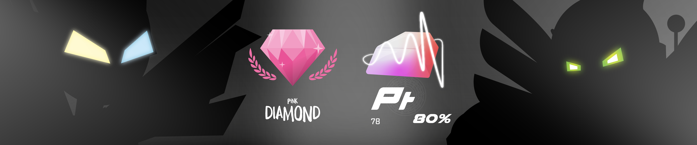
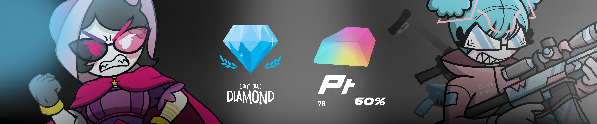

# Benvenuto

100 Carte Collezionabili divise in 5 Mazzi: Ciano, Magenta, Giallo, Key Color (Nero) e R3M1X.

Il Mazzo CMYK5 è una finestra sul WebVerse, il mondo dove le controparti digitali degli umani vivono e lavorano nel Web. Questi esserini vengono comunemente chiamati "Agent" o "Manager", stando a stretto contatto con noi senza che ci facciano sospettare di nulla. La costruzione del WebVerse si ispira all'iceberg, famosissimo modo per rappresentare l'interezza del Web. Ci sono un totale di 3 piani: [Surface Web, Deep Web e Dark Web](Remix/deep.md).

"CMYK" è l'acronimo che rappresenta i quattro colori primari della sintesi sottrattiva, il modello utilizzato nelle stampanti. Ogni mazzo di carte è associato a un tema e a un colore specifico: il mazzo Ciano include tutte le carte caratterizzate dal predominio del colore ciano, con un design minimalista e tecnologico; il mazzo Magenta, invece, si ispira al mondo della pittura e raccoglie carte prevalentemente magenta, seguendo lo stesso principio. Lo stesso vale per gli altri colori del modello quadricromico.

E il 5° mazzo? Rappresentato dal numero 5 nel nome, esso rappresenta il mazzo R3M1X, dedicato a carte che escono dai confini della sintesi sottrattiva. Qui troviamo elementi particolari come carte metalliche, ultravioletti, infrarossi e altri elementi o materiali insoliti. Più di ogni altro mazzo, il R3M1X racconta la storia che si cela dietro questa collezione, accompagnando ogni carta con una descrizione dettagliata.

## Le classi sociali

Tornando a parlare degli Agent essi sono fondamentali per permettere agli Utenti di accedere a Internet. Per capire meglio, possiamo immaginare i social Meta (Facebook, Instagram e WhatsApp) come enormi grattacieli che ospitano, in senso figurato, tutti i nostri dati organizzati in immense cassettiere. Queste cassettiere rappresentano i dati archiviati sui server distribuiti in tutto il mondo. Quest’architettura ha consentito ai Fondatori del Web, come lo conosciamo oggi, di sfruttare lavoratori operativi nel Web senza pagarli, concedendo loro in cambio solo la possibilità di esistere. Una pratica crudele che si è attenuata nel corso degli anni, dal 1980 fino a oggi, con l’emergere di diverse classi sociali.

La classe intermedia è composta proprio dagli Agent, e quindi dai lavoratori per Utenti Medi, come quelli che chiamiamo [IlPanettone](Magenta/ilpanettone.md) o [Pakolapp](Ciano/pakolapp.md). Al livello superiore troviamo i Manager, coloro che esercitano un potere amministrativo sugli Agent, diventando dei co-proprietari delle loro vite. È qui che entrano in gioco figure come [Solisnoctix](Magenta/solisnoctix.md) o [Post-Fry](Giallo/postfry.md). Infine, sul gradino più basso, ci sono gli [Overthrown](Remix/over.md). Per ulteriori dettagli su di loro, puoi cliccare sulla scritta dedicata.

Il mio Agent è [SamFollSF](Remix/samfollsf.md), ma prima di parlare di lui preferisco lasciare spazio agli altri.

## Scopri i cinque mazzi!

Bene, ora non ti resta che scoprire tutte e 100 le carte! Usa il navigatore qui in basso o in alto per proseguire.

- [Mazzo Ciano](Ciano/carteciano.md)
- [Mazzo Magenta](cartemag.md)
- [Mazzo Giallo](cartegia.md)
- [Mazzo Nero](cartener.md)
- [Mazzo R3M1X](carterem.md)

# Ordine del Potere

## Supreme

La sublimazione della differente natura strategica fra [Metalli Nobili](Magenta/shadowelite.md) e [Web Crystal](Remix/crystal.md). Nessuno sa cosa questi minerali siano capaci di fare, ma queste due sono le ipotesi più accreditate.

- [Platino](Remix/metal.md) con purezza al 100%: Tutti i metalli seguono la logica della creazione, della robustezza e dell'approccio brutale. La purezza al 100% garantisce il pieno potere a creare ogni oggetto che sia mai esistito nel WebVerse, anche il [Platino](Remix/metal.md) stesso, generando una perpetua crescita di potenza di calcolo, una mole di dati sempre più insostenibile che lascia spazio ad un solo avversario.

- [Diamante Oscuro](Remix/crystal.md): Se la logica dei [Metalli Nobili](Magenta/shadowelite.md) si basa sulla forza, i [Web Crystal](Remix/crystal.md) seguono una strategia più elegante, ottimizzata e astuta. Non cercano di vincere sulla mera forza, ma di trovare delle falle che permettano loro di essere ugualemente efficaci. Il [Diamante Oscuro](Remix/crystal.md) in risposta all'immensa capacità di creazione della controparte metallica, esso sceglie di non creare qualsiasi cosa, ma di modificare qualsiasi cosa, ogni legge della fisica, ogni funzionamento dell'ordine del potere magari rendendo il Key Colour forte quanto se stesso, oppure disattivare i collegamenti elettrici di tutto l'Iceberg del Web.

Il quadro è chiaro: L'[Ordine Metallico](Remix/metal.md) rappresenta la capacità del computer di creare (NEW), L'[Ordine Cristallino](Remix/crystal.md) incarna invece la possibilità di modificare (EDIT). Uno scontro a questi livelli lo vince non chi è più forte, ma chi è più creativo, chi ha più fantasia.
## Élite

La massiccia densità di elaborazione e calcolo dei dati rende questi minerali biomeccanicamente insostenibili per gli Agent e Manager, anche se esperimenti che sono costati la vita a cavie da laboratorio hanno permesso di scoprire cosa si celasse dietro il loro potere.

- [Platino](Remix/metal.md) con purezza all'80%: Oltre a creare oggetti che sfruttano i materiali già esistenti, il [Platino](Remix/metal.md) a questa purezza permette anche la trasformazione degli elementi che compongono la scena, riuscendo non solo a ricreare tutti i [Metalli Comuni](Magenta/shadowelite.md), ma anche quelli [Nobili](Remix/metal.md) fino all'[Oro](Remix/metal.md).

- [Diamante Rosa](Remix/crystal.md): Non si interviene più sulla modellazione del mondo, ma sulla modellazione del proprio codice sorgente con una conoscenza totale della propria natura informatica. Un [Bruto Dorato](Remix/metal.md) ti attacca? Frysco>Gold_Damage:Off. Stai affogando sott'acqua? GreenRoby05>Underwater_Respiration:On.

## Overlords

Il terzo gradino del podio è popolato dagli Overlord, Manager potentissimi che corrispondo una seria minaccia contro qualunque abitante del Web. Per l'ordine metallico troviamo il [Platino](Remix/metal.md) con il potere di creare oggetti istantaneamente e usarli come arma o assi nella manica sfruttando il materiale presente nell'ambiente circostante. Il [Diamante Azzurro](Remix/crystal.md) permette invece di modificare qualsiasi poligono nello spazio circostante, modellando e trasformando in cristallo l'ambiente con i relativi oggetti.
## Brute Bandwidth Force

La Bandwidth Force è la classe più prossima ai livelli più alti possibili, e il loro potenziale non è da meno. L'[Oro](Remix/metal.md) dalla sponda metallica offre una forza bruta in grado di disintegrare qualsiasi Agent in uno scontro corpo a corpo. Il [Rubino](Remix/crystal.md) invece offre una velocità di trasferimento dati così veloce da poter controllare i corpi dei propri nemici grazie al download istantaneo di un malware se trafitti.
## Sky Force

La Sky Force è formata dall'[Argento](Remix/metal.md) e dallo [Zaffiro](Remix/crystal.md). Qui gli scontri si combattono a mezz'aria, volando letteralmente oppure usando un [Cursore di Zaffiro](Remix/crystal.md).
## Thunder Force

Da questo gradino si inizia a fare sul serio, con la biforcazione del potere, da una parte i [Metalli Nobili](Remix/metal.md), dall'altra [Web Crystals](Remix/crystal.md) più potenti. La Thunder Force è composta dal [Rame](Remix/metal.md) e dallo [Smeraldo](Remix/crystal.md), entrambi con proprietà di conduzione elettrica.
## Borderline

In questo gradino troviamo Agent e Manager criminali in possesso di [Strumenti dei Fondatori](Remix/tool.md): Chiavi, Forbici e Bussole. Possedere uno di questi strumenti è considerato illegale, vista la loro straordinaria potenza. Con essi è possibile teletrasportarsi, duplicare oggetti o compiere scelte sempre corrette, grazie all’immensa capacità di calcolo che offrono. 
## Web Crystal

Nella categoria dei cittadini comuni del Web la classe più altolocata è quella in possesso dei [Web Crystals](Remix/crystal.md) minori, ciascuno con il proprio beneficio particolare.
## Key Colour

Il Nero, invece, si trova su un livello superiore. Al di sopra della sintesi CMY, il colore mancante. Questo colore non segue alcuna regola di bilanciamento: è indistintamente il più potente, ma non rappresenta ancora minimamente il massimo dei poteri.
## CMY

Sul gradino più basso troviamo la sintesi sottrattiva dei colori. Ogni Agent o Manager ha un proprio colore, che rappresenta la sua linfa vitale. Tuttavia, i colori interagiscono fra loro con bonus e malus, in modo simile al gioco "Sasso, Carta, Forbici": il Ciano contrasta il Magenta, ma subisce il Giallo; il Magenta vince sul Giallo, ma perde con il Ciano; e infine, il Giallo prevale sul Ciano, ma è battuto dal Magenta. 