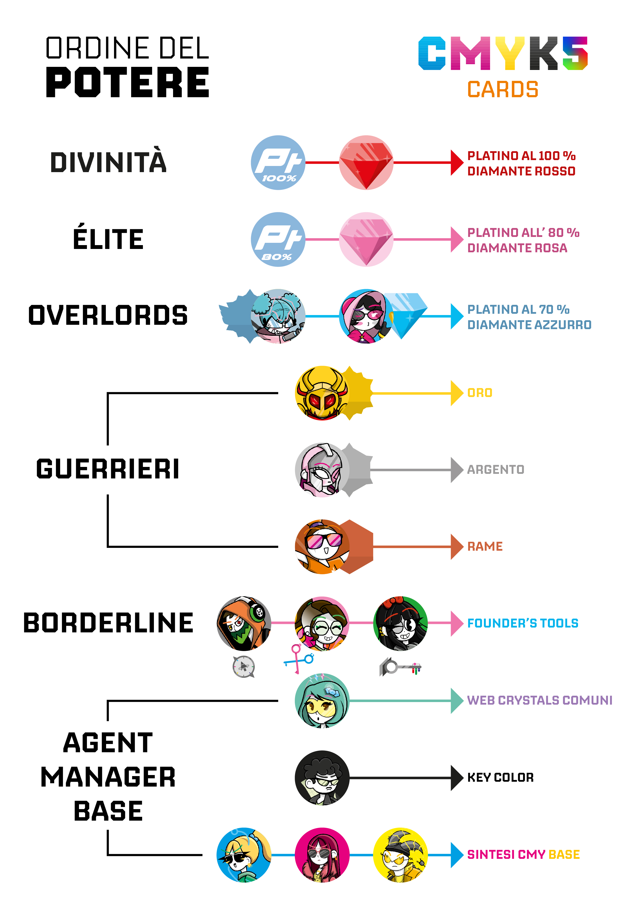

# Benvenuto

100 Carte Collezionabili divise in 5 Mazzi: Ciano, Magenta, Giallo, Key Color (Nero) e R3M1X.

Il Mazzo CMYK5 è una finestra sul WebVerse, il mondo dove le controparti digitali degli umani vivono e lavorano nel Web. Questi esserini vengono comunemente chiamati "Agent" o "Manager", stando a stretto contatto con noi senza che ci facciano sospettare di nulla. La costruzione del WebVerse si ispira all'iceberg, famosissimo modo per rappresentare l'interezza del Web. Ci sono un totale di 3 piani: [Surface Web, Deep Web e Dark Web](Remix/deep.md).

"CMYK" è l'acronimo che rappresenta i quattro colori primari della sintesi sottrattiva, il modello utilizzato nelle stampanti. Ogni mazzo di carte è associato a un tema e a un colore specifico: il mazzo Ciano include tutte le carte caratterizzate dal predominio del colore ciano, con un design minimalista e tecnologico; il mazzo Magenta, invece, si ispira al mondo della pittura e raccoglie carte prevalentemente magenta, seguendo lo stesso principio. Lo stesso vale per gli altri colori del modello quadricromico.

E il 5° mazzo? Rappresentato dal numero 5 nel nome, esso rappresenta il mazzo R3M1X, dedicato a carte che escono dai confini della sintesi sottrattiva. Qui troviamo elementi particolari come carte metalliche, ultravioletti, infrarossi e altri elementi o materiali insoliti. Più di ogni altro mazzo, il R3M1X racconta la storia che si cela dietro questa collezione, accompagnando ogni carta con una descrizione dettagliata.

## Le classi sociali

Tornando a parlare degli Agent essi sono fondamentali per permettere agli Utenti di accedere a Internet. Per capire meglio, possiamo immaginare i social Meta (Facebook, Instagram e WhatsApp) come enormi grattacieli che ospitano, in senso figurato, tutti i nostri dati organizzati in immense cassettiere. Queste cassettiere rappresentano i dati archiviati sui server distribuiti in tutto il mondo. Quest’architettura ha consentito ai Fondatori del Web, come lo conosciamo oggi, di sfruttare lavoratori operativi nel Web senza pagarli, concedendo loro in cambio solo la possibilità di esistere. Una pratica crudele che si è attenuata nel corso degli anni, dal 1980 fino a oggi, con l’emergere di diverse classi sociali.

La classe intermedia è composta proprio dagli Agent, e quindi dai lavoratori per Utenti Medi, come quelli che chiamiamo [IlPanettone](Magenta/ilpanettone.md) o [Pakolapp](Ciano/pakolapp.md). Al livello superiore troviamo i Manager, coloro che esercitano un potere amministrativo sugli Agent, diventando dei co-proprietari delle loro vite. È qui che entrano in gioco figure come [Solisnoctix](Magenta/solisnoctix.md) o [Post-Fry](Giallo/postfry.md). Infine, sul gradino più basso, ci sono gli [Overthrown](Remix/over.md). Per ulteriori dettagli su di loro, puoi cliccare sulla scritta dedicata.

Il mio Agent è [SamFollSF](Remix/samfollsf.md), ma prima di parlare di lui preferisco lasciare spazio agli altri.

## Scopri i cinque mazzi!

Bene, ora non ti resta che scoprire tutte e 100 le carte! Usa il navigatore qui in basso o in alto per proseguire.

- [Mazzo Ciano](Ciano/carteciano.md)
- [Mazzo Magenta](cartemag.md)
- [Mazzo Giallo](cartegia.md)
- [Mazzo Nero](cartener.md)
- [Mazzo R3M1X](carterem.md)

# Ordine del Potere

Come si classifica il potere del WebVerse?

## Agent e Manager Base

Sul gradino più basso troviamo la sintesi sottrattiva dei colori. Ogni Agent o Manager ha un proprio colore, che rappresenta la sua linfa vitale. Tuttavia, i colori interagiscono fra loro con bonus e malus, in modo simile al gioco "Sasso, Carta, Forbici": il Ciano contrasta il Magenta, ma subisce il Giallo; il Magenta vince sul Giallo, ma perde con il Ciano; e infine, il Giallo prevale sul Ciano, ma è battuto dal Magenta. 

Il Nero, invece, si trova su un livello superiore. Al di sopra della sintesi CMY, il colore mancante. Questo colore è non segue alcuna regola di bilanciamento: è indistintamente il più potente, ma non rappresenta ancora minimamente il massimo dei poteri.

Nella categoria dei cittadini comuni del web la classe più altolocata è quella in possesso dei [Web Crystals](Remix/crystal.md) minori, ciascuno con il proprio beneficio particolare. Il più potente in questa categoria è il [Rubino](Remix/crystal.md), mentre gli altri cristalli lasciano a discrezione personale decidere quale sia il più forte. Tuttavia, il cristallo più potente è il [Diamante](Remix/crystal.md), ma lo vedremo dopo con calma.

## Borderline

In questo gradino troviamo Agent e Manager criminali in possesso di [Strumenti dei Fondatori](Remix/tool.md): Chiavi, Forbici e Bussole. Possedere uno di questi strumenti è considerato illegale, vista la loro straordinaria potenza. Con essi è possibile teletrasportarsi, duplicare oggetti o compiere scelte sempre corrette, grazie all’immensa capacità di calcolo che offrono. 

## Guerrieri

Gli Agent e Manager in possesso di [Metalli Nobili](Remix/metal.md) vengono considerati guerrieri perchè nel [Surface Web](Remix/deep.md) è ammesso avere questi metalli solo su specifica autorizzazione del governo con scopo di pubblico ufficiale e forza dell'ordine. Ma sono in molti ad avere questi minerali senza consenso.

Si parte dal [Rame](Remix/metal.md), pessando per l'[Argento](Remix/metal.md) fino ad arrivare all'[Oro](Remix/metal.md). Esistono anche delle loro versioni alternative, come il Rame Ossidato o l'Oro bianco, ma non è oggi il momento di parlarne.

Con i guerreri entriamo nella sfera dei poteri speciali e unici, anche se messi a paragone con le categorie superiori diventano comunque insignificanti.

[SamFollSF](Remix/samfollsf.md) essendo in possesso di [Rame](Remix/metal.md) si trova circa a metà della piramide sociale del WebVerse.

## Overlords

Con gli Overlords accediamo alla biforcazione della vera forza che un Agent o Manager può esprimere. Da una parte troviamo il [Platino](Remix/metal.md) con purezza fino al 70%, il metallo nobile più prezioso del Web, dall'altra il [Diamante Azzurro](Remix/crystal.md), il primo [WebCrystal](Remix/crystal.md) ad essere considerato un degno avversario dei [Metalli Nobili](Remix/metal.md).

Abbiamo visto prima come i [WebCrystal](Remix/crystal.md) comuni siano molto più deboli dei [Metalli Nobili](Remix/metal.md), ma con il [Diamante](Remix/crystal.md) si riscrive completamente la gerarchia. Nemmeno un bruto dorato può fronteggiare con facilità un Manager in possesso di un [Diamante](Remix/crystal.md).

È difficile vedere un Agent nelle vesti di un Overlord, generalmente sono i Manager ad arrivare ad un livello di prestigio simile. Nell'immagine orientativa ho inserito [Wooby](Magenta/wooby.md) per rappresentare un Overlord metallizzato, e [Solisnoctix](Magenta/solisnoctix.md) per rappresentare un Overlord cristallino.

## Élite

L'Èlite nonostante sia in possesso di queste risorse, non può sprigionarne il completo potere. Questo perchè arrivati ad una certa soglia di purezza del [Platino](Remix/metal.md), oltre il 70%, diventa biomeccanicamente insostenibile per un abitante del Web, come se fossero radiazioni fortissime per il corpo umano. Stessa storia si verifica con il [Diamante Rosa](Remix/crystal.md).

Quello che l'Èlite del web sta cercando di fare è trovare un modo per alzare la soglia dove questi minerali diventano fatali, potendo ambire ad un potere mai visto nella storia.

Un esempio di Èlite è [Sa742Sa](Remix/sa742sa.md).

## Divinità

Qui entriamo in un territorio ambiguo, perchè nessuno nella storia ha mai raccontato o studiato cosa possa succedere ad un livello così inconcepibilmente alto. Possedere il 100% di [Platino](Remix/metal.md) per massa corporea o un carato di [Diamante Rosso](Remix/crystal.md) significherebbe diventare l'essere perfetto, ineluttabile, una vera e propria divinità. Vi lascio le opinioni di alcuni Agent e Manager presenti nel mazzo CMYK5.

Per [IlPanettone](Magenta/ilpanettone.md) tutta questa storia è solo una grande speculazione, un modo che hanno trovato gli Overlords per far parlare di sè. Secondo [The Deather](Ciano/thedea.md) invece si potrebbe essere così forti da poter riportare in vita gli abitanti del Web morti anche svariati anni fa. In una intervista [Angy](Giallo/angy.md) ha dichiarato che per lei possedere un [Diamante Rosso](Remix/crystal.md) significherebbe portare alla distruzione totale l'intero WebVerse, e che quindi sarebbe meglio fermarsi con questa follia di domare questi minerali che per natura sono proibiti. Durante un controllo in una miniera di [WebCrystal](Remix/crystal.md), [Lele](Ciano/lele.md) ha fatto questa domanda al suo boss [Solisnoctix](Magenta/solisnoctix.md): per lei potrebbe essere un modo per liberarsi dalla schiavitù degli umani sugli abitanti del Web, magari arrivare in un mondo parallelo dove tutta la crudeltà di questo universo non esiste.

[SamFollSF](Remix/samfollsf.md) non crede a tutte queste storie, per lui c'è qualcosa che non quadra con la realtà del Web. Il potere non può salire all'infinito, si dovrà arrivare ad un punto, e forse qualcosa o qualcuno volutamente sta cercando di sabotare le ricerche per arrivarci. D'altronde, perché i fondatori del Web non sono ancora vivi per raccontarlo? La credenza popolare più diffusa è che siano morti al passaggio dal Web 1.0 a quello 2.0, secondo cui la struttura fisica degli Agent e Manager dell'epoca non sarebbe stata compatibile con un evoluzione architettonica simile. Ma questa versione rimane ancora solo una teoria e niente di confermato.

Disclaimer doveroso: Il mazzo CMYK5 non finisce qui, sarà sempre in continua espansione con nuove carte, quindi ti consiglio di seguirmi su [Instagram](https://www.instagram.com/samfoll.design?igsh=enB6NHZiMWt1bnl6) per rimanere sempre aggiornato o di usare la scheda dedicata [News](blog/index.md) nel sito.